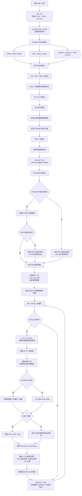

# 程序工作流程图

本文档描述 `Core/Src/main.c` 的主执行流程，重点覆盖启动初始化、周期传感器采集、LCD 显示刷新和阿里云 IoT 通信状态机。

## 主循环逻辑

1. 系统启动后先完成 HAL、系统时钟和 CubeMX 外设初始化。
2. 用户代码继续初始化 LED、按键、蜂鸣器、延时、LCD、DHT11、光敏传感器、ESP8266 和 MPU6050。
3. LCD 先显示启动状态，初始化完成后切换到传感器仪表盘页面。
4. 主循环中，传感器和 LCD 每 `500ms` 刷新一次。
5. `AliyunIoT_Task()` 每轮循环都会运行，用于持续推进 ESP8266 AT 指令和云端通信流程。

