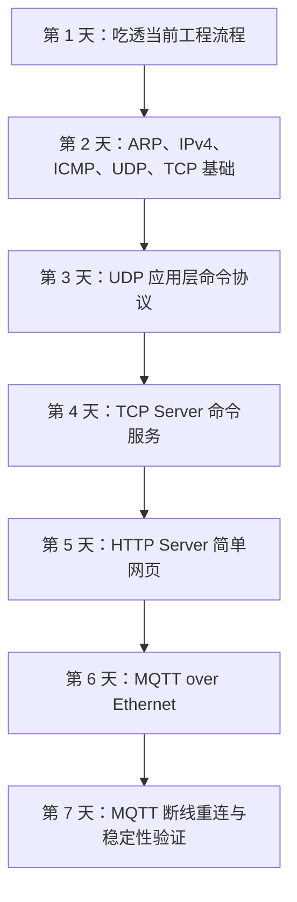

# STM32F407 LwIP 7 天学习总览

本系列学习围绕 STM32F407、LAN8720/PHY、LwIP、UDP、TCP、HTTP、MQTT 和 EMQX 展开。

7 天学习的主线是：

```text
先理解当前工程怎么跑
再理解以太网基础收发
再从 UDP、TCP、HTTP 逐步走到 MQTT
最后验证 MQTT 在异常情况下能否自动恢复
```

## 1. 学习路线总图



核心协议层次可以理解为：

```text
Ethernet
  -> ARP
  -> IPv4
      -> ICMP / UDP / TCP
          -> HTTP / MQTT
```

## 2. 七天内容索引

| 天数 | 文档 | 学习重点 | 实验结果 |
| --- | --- | --- | --- |
| 第 1 天 | [阶段 1：吃透当前工程流程](stage-1-current-project-flow.md) | 工程入口、初始化、裸机轮询、LwIP 调用链 | 明确当前工程从 `main()` 到 LwIP 的运行路径 |
| 第 2 天 | [阶段 2：理解基础网络流程](stage-2-basic-network-flow.md) | Ethernet、ARP、IPv4、ICMP、UDP、TCP | 完成 ping、ARP 表、基础网络收发理解 |
| 第 3 天 | [阶段 3：UDP 应用协议](stage-3-udp-application-protocol.md) | UDP echo、命令解析、pbuf、PowerShell/串口助手 UDP 测试 | 完成 `ping`、`sensor`、`led on/off/toggle` 等 UDP 命令 |
| 第 4 天 | [阶段 4：TCP Server](stage-4-tcp-server.md) | TCP Server、accept/recv/sent/close 回调、命令服务 | PC Client 可连接 STM32 TCP Server 并发送命令 |
| 第 5 天 | [阶段 5：HTTP Server](stage-5-simple-http-page.md) | HTTP 请求/响应、浏览器访问、简单页面 | 浏览器可访问 STM32 HTTP 页面 |
| 第 6 天 | [阶段 6：MQTT over Ethernet](stage-6-mqtt-over-ethernet.md) | EMQX、MQTTX、CONNECT/CONNACK、PUBLISH、SUBSCRIBE、PINGREQ | STM32 可连接 Broker，发布传感器数据，接收 LED 控制 |
| 第 7 天 | [阶段 7：MQTT 断线重连与状态机工程化](stage-7-mqtt-reconnect-state-machine.md) | MQTT 状态机、断线重连、Broker 异常、物理链路异常恢复 | 完成 4 组稳定性实验 |

## 3. 第 1 天：吃透当前工程流程

第 1 天的目标不是写新功能，而是先把当前工程跑起来的路径看懂。

重点掌握：

- `main()` 初始化顺序。
- 裸机主循环如何周期调用任务。
- `MX_LWIP_Init()` 负责初始化 LwIP。
- `MX_LWIP_Process()` 在 `NO_SYS=1` 裸机工程中负责推进网络处理。
- link up 后以太网接口如何进入可用状态。
- 收包和发包分别经过哪些函数。

这一阶段建立了后面所有网络实验的基础：先知道代码怎么动，再去改代码。

## 4. 第 2 天：理解基础网络流程

第 2 天把网络通信拆成几层来看：

- ARP：通过 IP 找 MAC。
- Ethernet：真正传输二层帧。
- IPv4：标识源 IP 和目标 IP。
- ICMP：ping 使用的协议。
- UDP：无连接，适合简单命令和 echo。
- TCP：有连接，适合可靠通信。

关键理解：

```text
ping 不只是 ICMP，它前面通常还要先完成 ARP。
```

也就是说，如果 ping 不通，不能只看 ICMP，还要看：

- PC 的 IP 是否正确。
- STM32 的 IP 是否正确。
- ARP 表是否建立。
- STM32 是否收到 ARP request。
- STM32 是否发出 ARP reply。

## 5. 第 3 天：UDP 应用协议

第 3 天开始写应用层命令。

UDP 命令包括：

```text
ping
hello stm32
sensor
led on
led off
led toggle
```

已经验证：

- PowerShell 可以发送 UDP 到 `192.168.10.123:5000`。
- 串口助手的 UDP 功能也可以通信。
- STM32 能根据不同 payload 返回不同响应。
- LED 命令可以控制板载 LED。

这一阶段的关键收获是：

```text
UDP 很轻量，但需要应用层自己定义命令和回复格式。
```

## 6. 第 4 天：TCP Server

第 4 天把 STM32 作为 TCP Server。

重点掌握：

- `tcp_new()`
- `tcp_bind()`
- `tcp_listen()`
- `tcp_accept()`
- `tcp_recv()`
- `tcp_write()`
- `tcp_close()`

实验结果：

- STM32 监听 TCP 端口。
- PC Client 可以连接 STM32。
- PC 发送 `ping`、`sensor`、`hello stm32` 等命令。
- STM32 串口打印连接、命令和回复。

这一阶段把“无连接 UDP”推进到“有连接 TCP”。

## 7. 第 5 天：HTTP Server

第 5 天在 TCP Server 基础上理解 HTTP。

核心理解：

```text
HTTP 本质上也是 TCP 上的一种文本协议。
```

浏览器访问 STM32 时，会发送类似：

```text
GET / HTTP/1.1
```

STM32 需要返回：

```text
HTTP/1.1 200 OK
Content-Type: text/html

网页内容
```

实验结果：

- 浏览器可以访问 STM32 的 HTTP 页面。
- `/` 和 `/test` 路径可以被识别。
- `/favicon.ico` 请求也能在串口看到。

这一阶段把 TCP 命令服务升级成了浏览器可访问的 HTTP 服务。

## 8. 第 6 天：MQTT over Ethernet

第 6 天开始进入物联网常用通信模型。

本阶段使用：

- EMQX：本地 MQTT Broker。
- Docker Desktop：运行 EMQX 容器。
- MQTTX：PC 侧 MQTT 客户端。
- STM32：MQTT Client。

核心 topic：

| topic | 方向 | 用途 |
| --- | --- | --- |
| `stm32/sensor` | STM32 -> Broker -> MQTTX | 上报传感器数据 |
| `stm32/cmd` | MQTTX -> Broker -> STM32 | 下发 LED 控制命令 |
| `stm32/status` | STM32 -> Broker -> MQTTX | 回传 LED 状态和命令执行结果 |

完成能力：

- STM32 主动连接 EMQX `192.168.10.100:1883`。
- 发送 MQTT CONNECT。
- 收到 CONNACK。
- 周期 PUBLISH 传感器 JSON。
- SUBSCRIBE `stm32/cmd`。
- 接收 `led toggle` 并控制 LED。
- 回传 `stm32/status`。
- 周期 PINGREQ，收到 PINGRESP。

第 6 天解决的是：

```text
MQTT 能不能跑通？
```

## 9. 第 7 天：MQTT 稳定性

第 7 天解决的是：

```text
MQTT 断了以后能不能自己恢复？
```

程序能力从“一次性连接”升级为“状态机重连”。

重点状态包括：

- 空闲等待。
- TCP 连接中。
- 等待 CONNACK。
- 等待 SUBACK。
- MQTT 已连接。
- 重连等待。
- link down 清理连接。

完成的 4 组稳定性实验：

| 实验 | 场景 | 结论 |
| --- | --- | --- |
| 实验 1 | 正常上电连接、发布、订阅、LED 控制 | 通过 |
| 实验 2 | Docker Restart 重启 EMQX | 记录 Dashboard 短时网络错误和恢复现象 |
| 实验 3 | Broker 关闭再开启 | 通过 |
| 实验 4 | 网线断开再插回 | 通过 |

第 7 天最重要的工程结论是：

```text
稳定性不是只看能不能连上，而是看断开后能不能清理、等待、重连、重新订阅、恢复业务。
```

## 10. 当前最终程序能力

当前程序已经具备下面这些能力：

- 以太网初始化。
- PHY link up/link down 检测。
- ARP、ICMP、UDP、TCP、HTTP、MQTT 基础通信。
- UDP 命令服务。
- TCP 命令服务。
- HTTP 简单页面服务。
- MQTT Client 连接 EMQX。
- MQTT 发布传感器 JSON。
- MQTT 订阅 LED 控制命令。
- MQTT 状态回传。
- MQTT 心跳。
- MQTT Broker 异常重连。
- 网线断开恢复。

关键代码状态：

```c
MQTT_Client_Init();
MQTT_Client_Process();
HAL_ETH_Start(&heth);
```

保留的调试策略：

```c
#define ETH_DEBUG_ARP   (0U)
#define ETH_DEBUG_ICMP  (1U)
```

## 11. 重要问题与最终修复

学习过程中遇到过一个关键问题：

```text
ARP 表可能存在，但 ping 和 MQTT 仍然异常。
MQTT tcp connect 后可能出现 err=-13。
```

最终定位：

```text
当前工程是 NO_SYS=1 + MX_LWIP_Process() 轮询收包模型。
以太网启动方式应使用 HAL_ETH_Start(&heth)，而不是 HAL_ETH_Start_IT(&heth)。
```

修复后：

- ping 恢复。
- ARP/ICMP 收发恢复。
- MQTT 连接恢复。
- MQTT 发布订阅恢复。

这个问题已经整理到第 7 天文档的最后一章“连接错误排查方法”中。

## 12. 你现在已经掌握了什么

完成这 7 天后，已经不只是“能让板子联网”，而是能解释并排查一条完整链路：

```text
网线是否 link up
PC 和 STM32 是否在同一网段
ARP 是否能解析
ping 是否能进 STM32
UDP/TCP 是否能收发
HTTP/MQTT 是否能建立应用层协议
MQTT 断开后是否能恢复
```

可以认为你已经完成了 STM32 以太网 LwIP 入门到 MQTT 稳定性验证的一轮闭环学习。

## 13. 后续学习建议

后续可以从下面几个方向继续走：

1. MQTT QoS 1：学习 PUBACK 和消息确认。
2. MQTT Retain：让新客户端订阅后立刻拿到最近状态。
3. Last Will：设备掉线时让 Broker 自动发布遗嘱消息。
4. JSON 命令协议升级：把 `led toggle` 改成结构化 JSON。
5. 真实传感器数据上报：把温湿度、光照、姿态角统一成设备影子格式。
6. 接入云平台：把本地 EMQX 经验迁移到阿里云 IoT 或其它云平台。
7. 长时间压力测试：运行 12 小时或 24 小时，观察内存、重连和心跳稳定性。

当前最自然的下一步是：

```text
MQTT QoS 1 + 更规范的 JSON 命令协议
```

