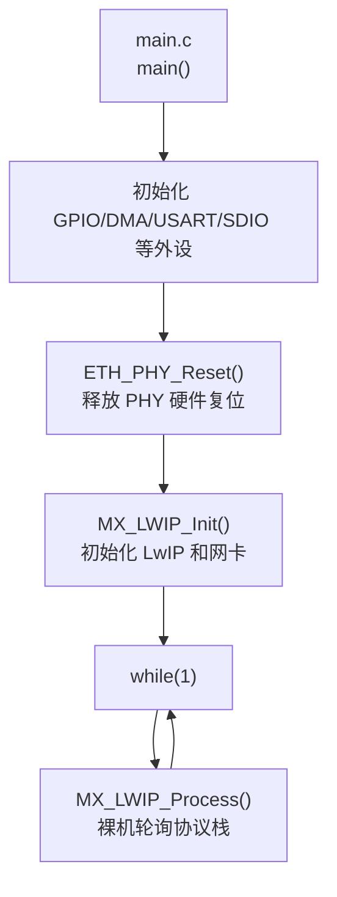
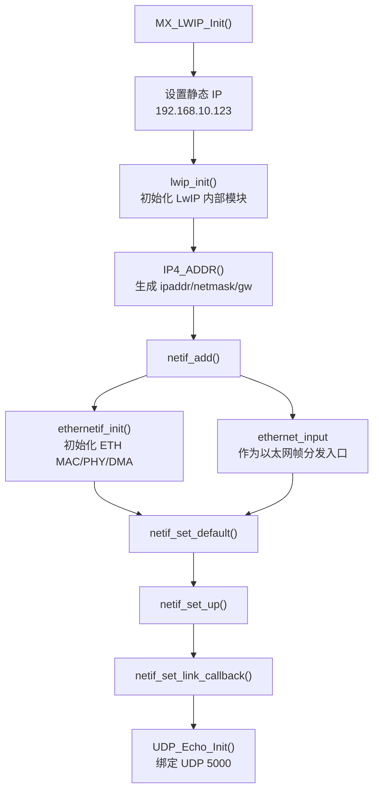
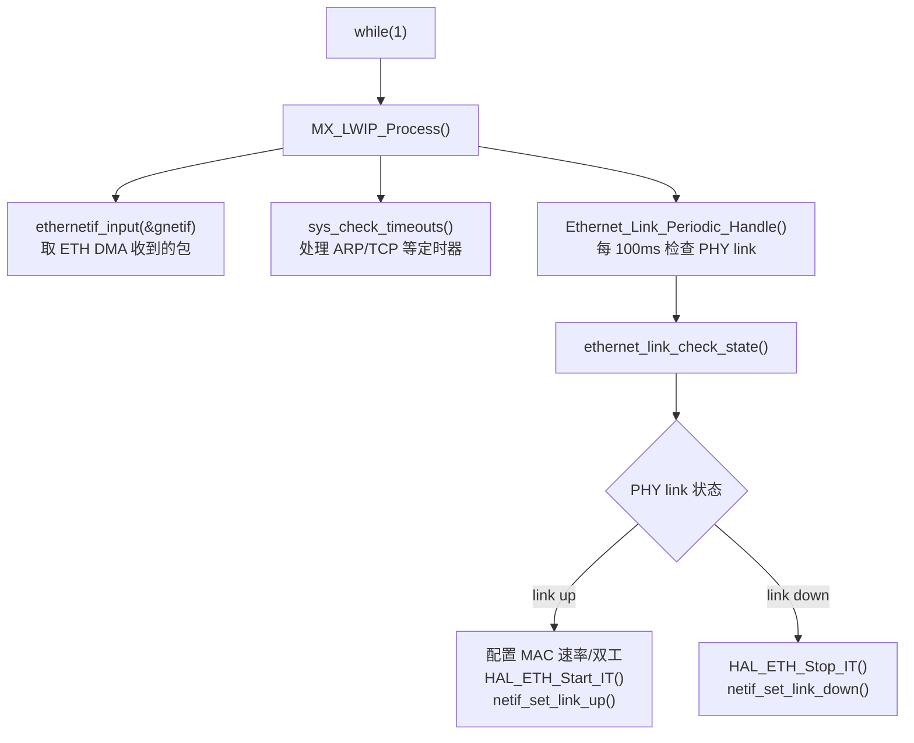
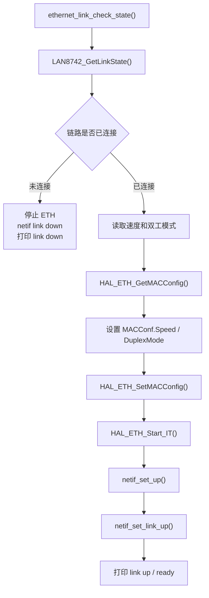
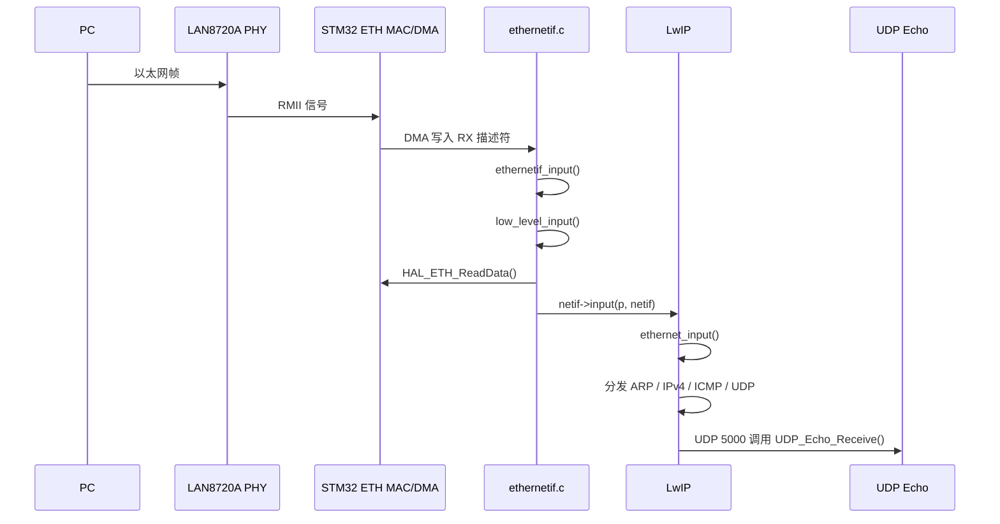
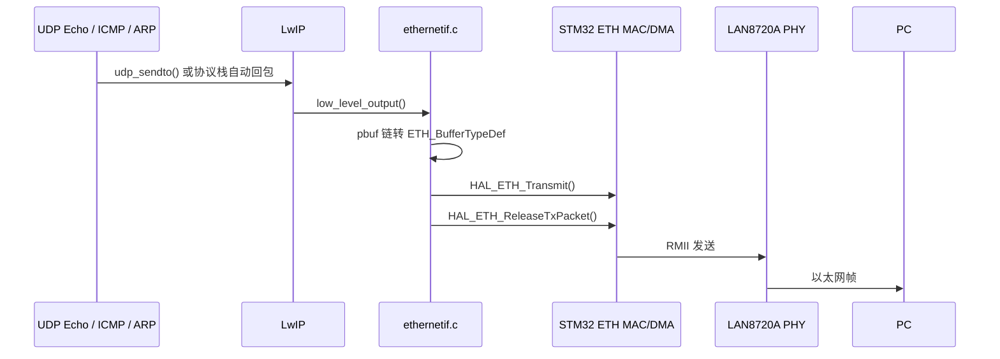
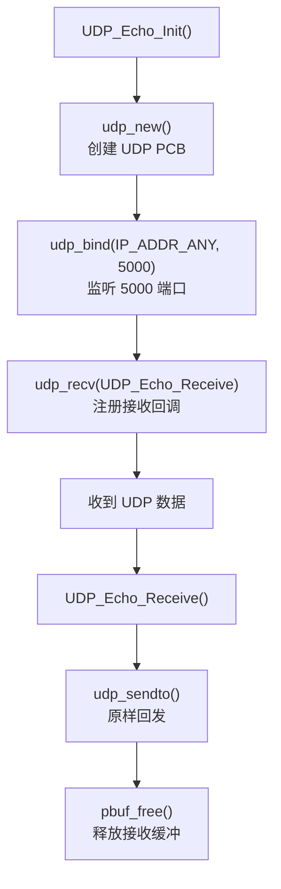

# 阶段 1：吃透当前工程的 LwIP 调用逻辑

本阶段目标不是新增功能，而是看懂当前工程里的 LwIP 如何启动、如何轮询、如何从网口收包、如何把数据交给 UDP Echo 应用。

当前工程运行模式：

- MCU：STM32F407
- PHY：LAN8720A/LAN8742 类 RMII PHY
- LwIP 模式：裸机 `NO_SYS=1`
- 开发板 IP：`192.168.10.123`
- PC 有线 IP：`192.168.10.100`
- UDP Echo 端口：`5000`

## 1. 本阶段要掌握什么

学习完成后，你应该能回答：

- `MX_LWIP_Init()` 做了什么？
- 为什么主循环必须一直调用 `MX_LWIP_Process()`？
- `netif_add()` 为什么要传入 `ethernetif_init` 和 `ethernet_input`？
- `ethernetif_input()` 如何把 ETH DMA 收到的数据交给 LwIP？
- `low_level_output()` 如何把 LwIP 要发送的数据交给 ETH DMA？
- 为什么必须等串口打印 `link up` / `ready` 后再测试 ping？

## 2. 代码入口总览

主要文件：

- `Core/Src/main.c`
- `LWIP/App/lwip.c`
- `LWIP/Target/ethernetif.c`
- `LWIP/App/udp_echo.c`
- `LWIP/Target/lwipopts.h`

整体关系：



关键点：

- `ETH_PHY_Reset()` 必须在 `MX_LWIP_Init()` 之前执行，否则 PHY 可能一直被硬件下拉保持复位。
- 当前没有 FreeRTOS，所以 LwIP 不会自己跑线程，必须靠 `while(1)` 里持续调用 `MX_LWIP_Process()`。

## 3. 初始化调用逻辑

`MX_LWIP_Init()` 位于 `LWIP/App/lwip.c`。

初始化流程：



`netif_add()` 是非常关键的一步。它把 LwIP 的“虚拟网卡对象” `gnetif` 和底层硬件驱动连接起来。

简化理解：

```text
gnetif = LwIP 眼中的网卡
ethernetif_init = 这张网卡怎么初始化硬件
ethernet_input = 收到以太网帧后如何交给 LwIP 分发
```

## 4. 裸机轮询逻辑

`MX_LWIP_Process()` 位于 `LWIP/App/lwip.c`，主循环一直调用它。



如果 `MX_LWIP_Process()` 停止调用，会出现：

- 收到的数据包不再被取出。
- ARP/TCP 等定时器不再推进。
- link up/down 状态不能及时同步。
- UDP Echo 不响应。

## 5. Link Up 为什么重要

`ethernet_link_check_state()` 位于 `LWIP/Target/ethernetif.c`。

它负责把 PHY 的物理链路状态同步给 STM32 ETH MAC 和 LwIP。



测试前必须等串口出现：

```text
[ETH] link up: 10M half duplex
[ETH] ready: ping 192.168.10.123, UDP echo port 5000
```

否则 MAC/DMA 可能还没有真正开始收发，PC 的 ARP 请求不会得到回应。

## 6. 收包调用逻辑

当 PC 发 ARP、ping、UDP 数据时，数据从网口进入。



关键函数：

- `ethernetif_input()`
- `low_level_input()`
- `HAL_ETH_ReadData()`
- `netif->input(p, netif)`
- `ethernet_input()`

## 7. 发包调用逻辑

当开发板要回复 ARP、ping、UDP Echo 时，数据从 LwIP 发回网口。



关键函数：

- `udp_sendto()`
- `low_level_output()`
- `HAL_ETH_Transmit()`
- `HAL_ETH_ReleaseTxPacket()`

注意：当前工程已经修复了 TX 描述符释放问题。阻塞发送后会调用 `HAL_ETH_ReleaseTxPacket()`，避免发送描述符长期占用。

## 8. UDP Echo 调用逻辑

`UDP_Echo_Init()` 位于 `LWIP/App/udp_echo.c`。



PowerShell 测试：

```powershell
$u = New-Object System.Net.Sockets.UdpClient
$u.Client.Bind([Net.IPEndPoint]::new([Net.IPAddress]::Parse("192.168.10.100"),0))
$bytes = [Text.Encoding]::ASCII.GetBytes("hello stm32")
$u.Send($bytes,$bytes.Length,"192.168.10.123",5000)
$remote = [Net.IPEndPoint]::new([Net.IPAddress]::Any,0)
[Text.Encoding]::ASCII.GetString($u.Receive([ref]$remote))
$u.Close()
```

预期返回：

```text
hello stm32
```

## 9. 本阶段调试清单

每次测试前：

```powershell
Get-NetIPAddress -InterfaceAlias "以太网" -AddressFamily IPv4
```

确认：

```text
IPAddress    : 192.168.10.100
AddressState : Preferred
```

串口确认：

```text
[ETH] IP=192.168.10.123 NETMASK=255.255.255.0 GW=192.168.10.1
[ETH] link up
[ETH] ready: ping 192.168.10.123, UDP echo port 5000
```

ping 测试：

```powershell
arp -d *
ping -S 192.168.10.100 192.168.10.123
arp -a
```

成功标志：

```text
来自 192.168.10.123 的回复
192.168.10.123  00-80-e1-00-00-00  动态
```

## 10. 阶段总结

当前工程的主调用链可以记成：

```text
main()
  -> ETH_PHY_Reset()
  -> MX_LWIP_Init()
      -> lwip_init()
      -> netif_add(... ethernetif_init, ethernet_input)
      -> UDP_Echo_Init()
  -> while(1)
      -> MX_LWIP_Process()
          -> ethernetif_input()
          -> sys_check_timeouts()
          -> Ethernet_Link_Periodic_Handle()
```

只要理解这条链路，就已经掌握了当前裸机 LwIP 工程最核心的运行方式。
