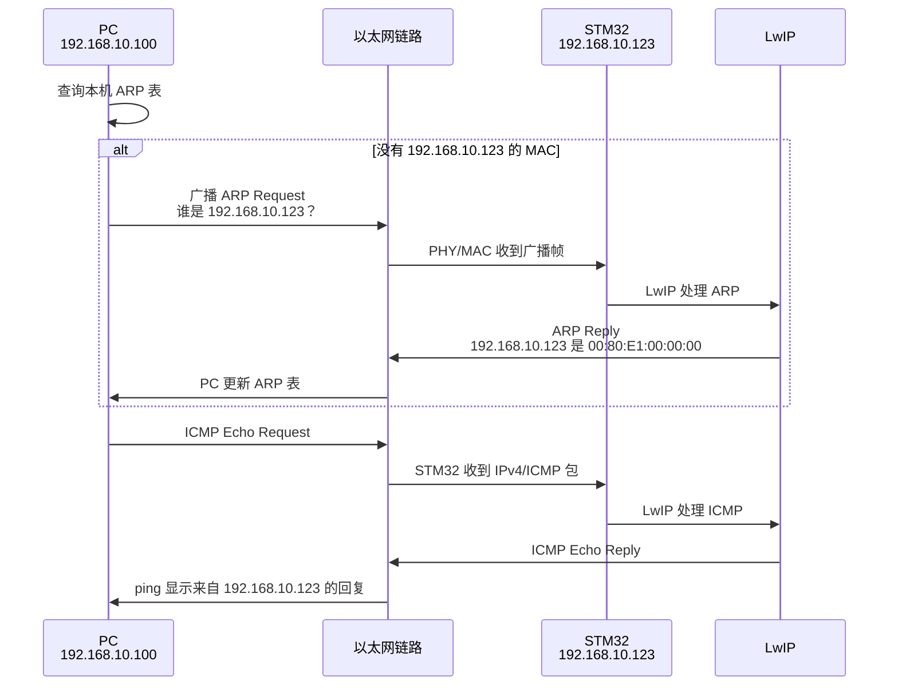
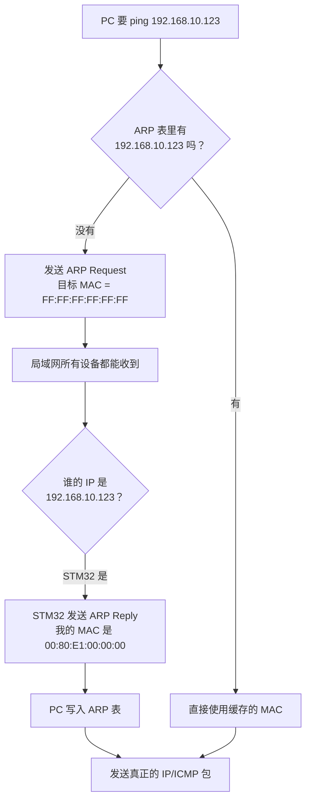
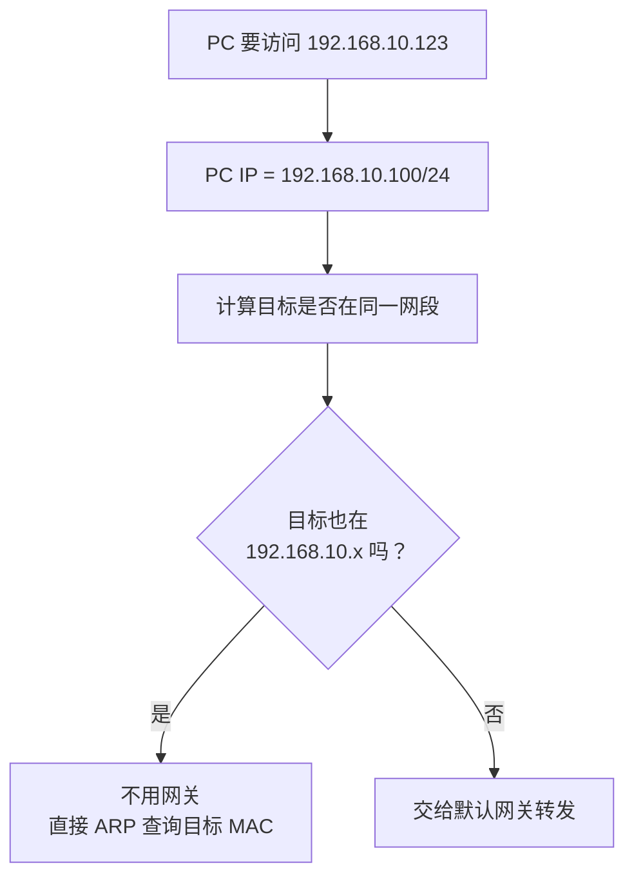
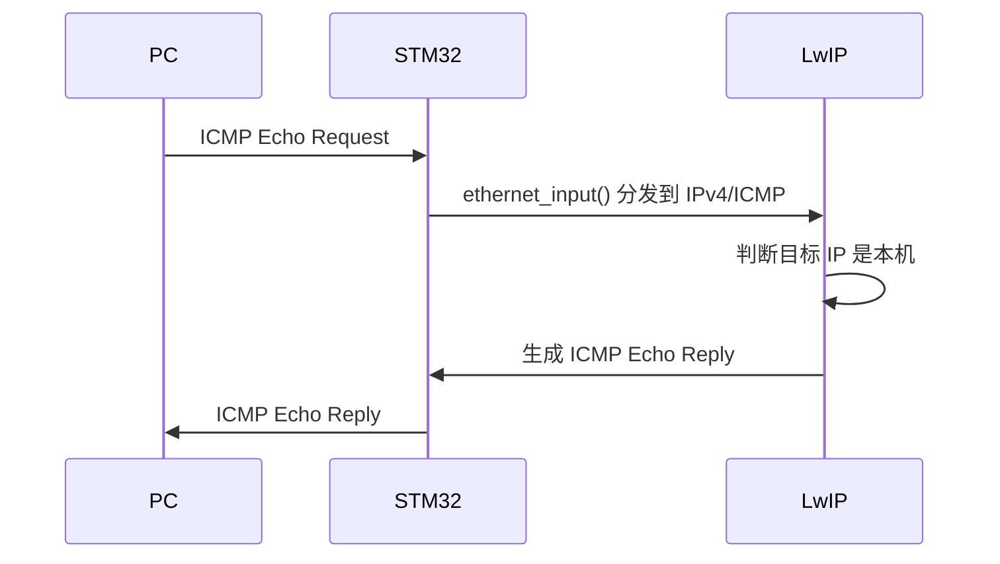
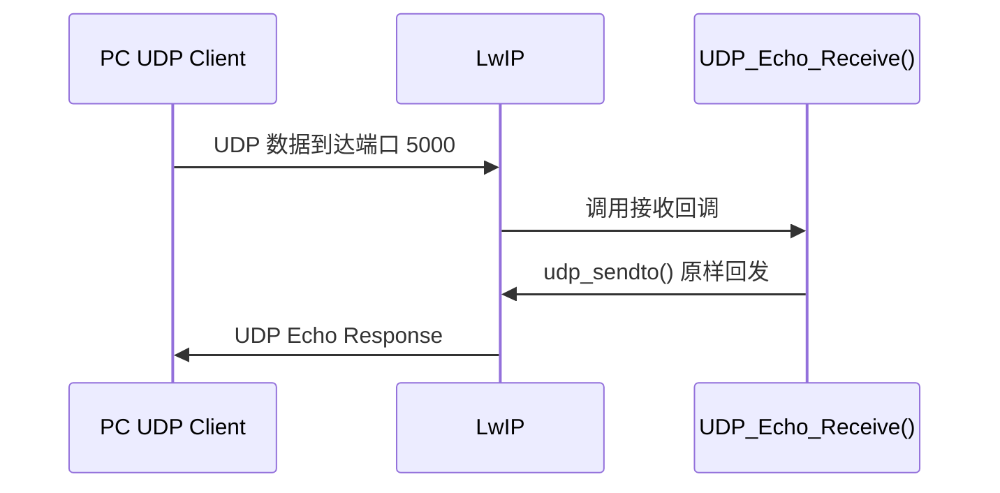
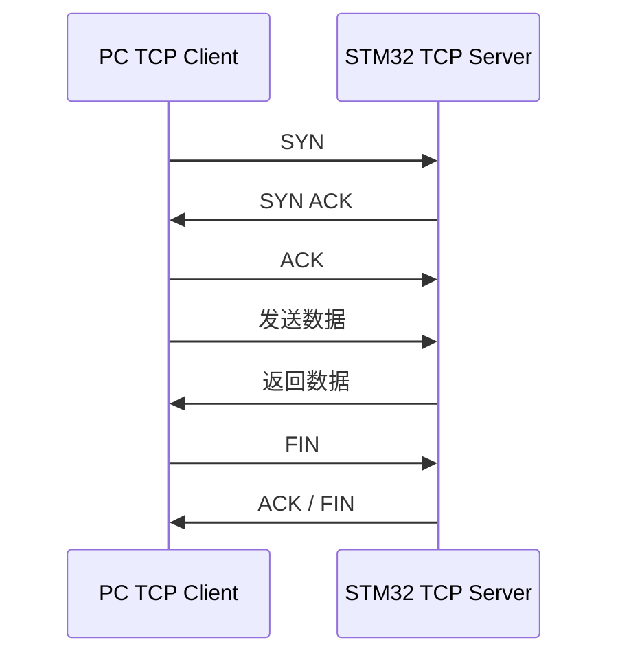
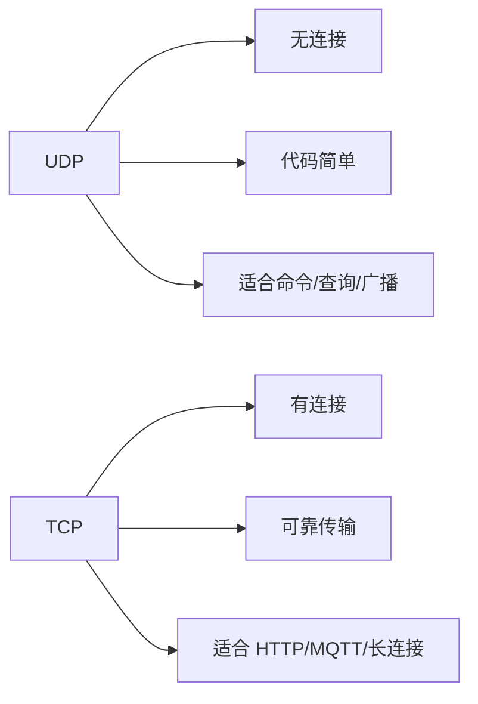
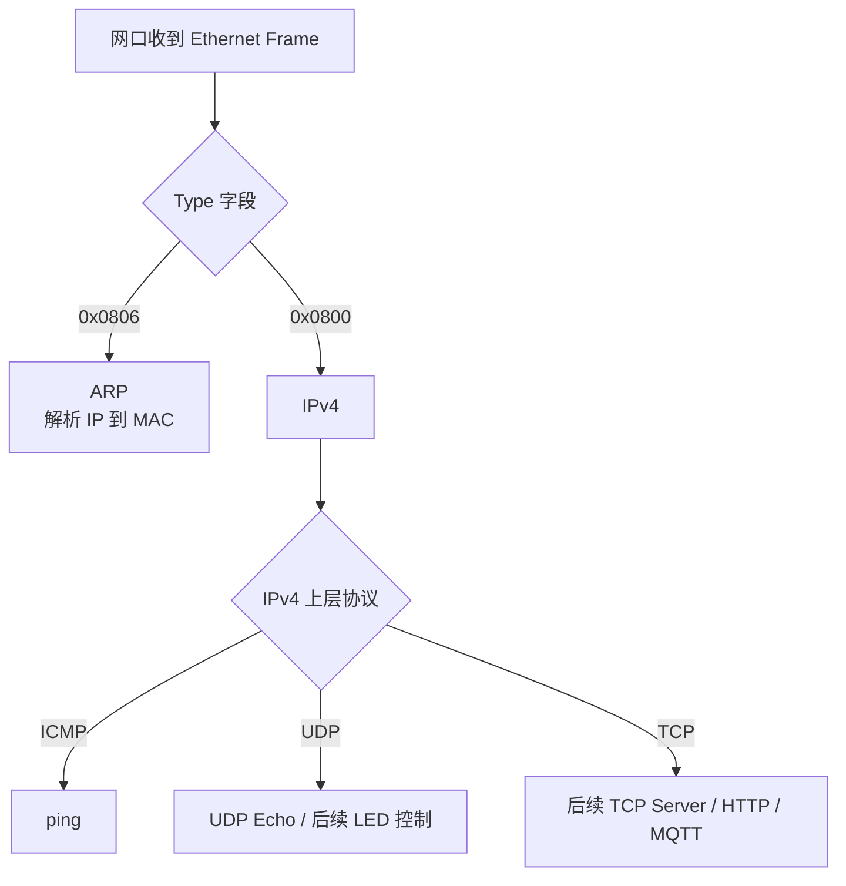
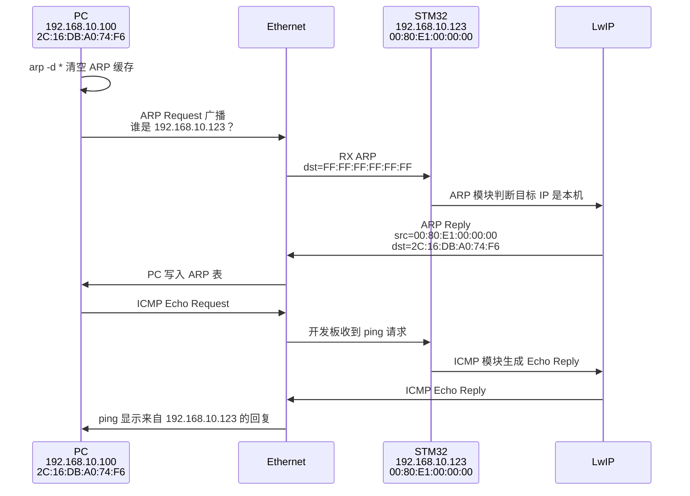
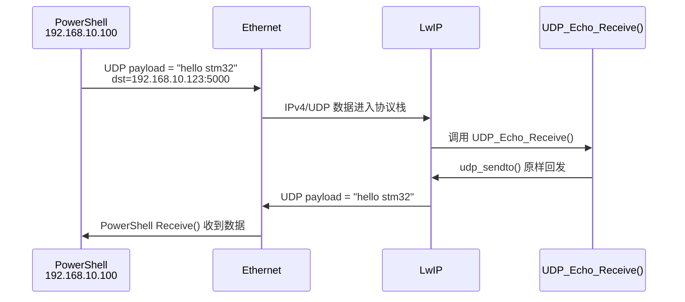

# 阶段 2：理解基础网络流程

本阶段目标：能解释一次 `ping` 或 UDP Echo 从 PC 到 STM32 开发板到底发生了什么。

当前工程测试环境：

- PC 有线网卡：`192.168.10.100/24`
- STM32 开发板：`192.168.10.123/24`
- STM32 MAC：`00:80:E1:00:00:00`
- UDP Echo 端口：`5000`

测试前先等待串口出现：

```text
[ETH] link up
[ETH] ready: ping 192.168.10.123, UDP echo port 5000
```

## 1. 本阶段要掌握什么

学习完成后，你应该能回答：

- 为什么 ping 前通常会先发生 ARP？
- `arp -a` 里的 MAC 地址是什么意思？
- `192.168.10.100/24` 和 `192.168.10.123/24` 为什么能直接通信？
- ping 属于什么协议？
- UDP Echo 和 ping 的区别是什么？
- TCP 和 UDP 最核心的区别是什么？

## 2. 从 PC ping STM32 的整体流程

执行命令：

```powershell
arp -d *
ping -S 192.168.10.100 192.168.10.123
arp -a
```

整体流程：



关键理解：

- ARP 负责“IP 地址 -> MAC 地址”。
- ping 实际使用 ICMP。
- PC 只有知道开发板 MAC 后，才能把 ICMP 包封装成以太网帧发出去。

## 3. ARP：IP 地址如何变成 MAC 地址

ARP 的作用：在同一个局域网内，根据 IP 找到对应设备的 MAC 地址。

当前例子：

```text
PC 想访问：192.168.10.123
PC 需要知道：192.168.10.123 对应哪个 MAC？
STM32 回答：00:80:E1:00:00:00
```

ARP 流程图：



查看 ARP 表：

```powershell
arp -a
```

成功时应该看到：

```text
192.168.10.123  00-80-e1-00-00-00  动态
```

如果没有这行，说明还没到 ping 阶段，问题停在 ARP 阶段。

## 4. Ethernet Frame：网线上真正传输的单位

以太网上传输的基本单位是 Ethernet Frame。

简化结构：


常见 Type：

| Type | 含义 |
| --- | --- |
| `0x0806` | ARP |
| `0x0800` | IPv4 |

所以：

- ARP 包会放在 Ethernet Frame 里，Type 是 `0x0806`。
- IPv4 包也会放在 Ethernet Frame 里，Type 是 `0x0800`。

在当前工程中，`ethernetif.c` 里根据这两个字节判断包类型：

```c
payload[12] == 0x08
payload[13] == 0x06  // ARP

payload[12] == 0x08
payload[13] == 0x00  // IPv4
```

## 5. IPv4：为什么 192.168.10.100 能直接访问 192.168.10.123

PC 有线网卡：

```text
192.168.10.100/24
```

STM32：

```text
192.168.10.123/24
```

`/24` 等价于：

```text
255.255.255.0
```

这表示网络号是前三段：

```text
192.168.10.x
```

判断逻辑：



当前 STM32 和 PC 在同一网段，所以不需要路由器，也不需要互联网。

这也是为什么把开发板从 `192.168.1.123` 改到 `192.168.10.123` 后更稳定：它避开了 WLAN 的 `192.168.1.x` 网段冲突。

## 6. ICMP：ping 是怎么工作的

ping 使用 ICMP 协议。

一次 ping 的核心是：

```text
PC -> STM32: ICMP Echo Request
STM32 -> PC: ICMP Echo Reply
```

流程图：



PowerShell 成功输出：

```text
来自 192.168.10.123 的回复: 字节=32 时间=1ms TTL=255
```

注意：

```text
来自 192.168.10.100 的回复: 无法访问目标主机
```

这不是开发板回复，而是 PC 本机说“我找不到目标主机”。通常表示 ARP 没成功。

## 7. UDP：无连接通信

UDP 的特点：

- 不建立连接。
- 发出去就结束。
- 对方收到就处理。
- 不保证一定送达。
- 适合简单控制、传感器查询、局域网测试。

当前 UDP Echo：

```text
PC -> STM32: "hello stm32"
STM32 -> PC: "hello stm32"
```

调用流程：



当前代码中的应用层入口：

```c
udp_recv(UdpEchoPcb, UDP_Echo_Receive, NULL);
```

意思是：当端口 5000 收到 UDP 数据时，LwIP 会调用 `UDP_Echo_Receive()`。

## 8. TCP：有连接通信

TCP 的特点：

- 需要建立连接。
- 可靠传输。
- 有顺序控制。
- 有重传。
- 代码状态比 UDP 复杂。

TCP 通信流程：



对比 UDP：



后续 TCP Server、HTTP、MQTT 都会基于 TCP。

## 9. 当前工程中各协议的位置



当前已经跑通：

- ARP
- IPv4
- ICMP ping
- UDP Echo

后续要学习：

- UDP 应用协议
- TCP Server
- HTTP
- MQTT over Ethernet

## 10. 本阶段实验

### 实验 1：观察 ARP

```powershell
arp -d *
ping -S 192.168.10.100 192.168.10.123
arp -a
```

观察：

```text
192.168.10.123  00-80-e1-00-00-00  动态
```

结论：

PC 已经知道开发板 IP 对应的 MAC。

### 实验 1.1：结合真实输出分析 ARP 和 ping

这次测试使用了三条命令：

```powershell
arp -d *
ping -S 192.168.10.100 192.168.10.123
arp -a
```

其中 `arp -d *` 的作用是清空 PC 本机的 ARP 缓存。这样下一次访问 `192.168.10.123` 时，PC 不能直接使用旧的 MAC 地址，必须重新发起 ARP 查询。这个命令很适合用来观察“第一次 ping 前到底发生了什么”。

`ping -S 192.168.10.100 192.168.10.123` 的意思是：强制 Windows 使用 `192.168.10.100` 这个有线网卡 IP 作为源地址，去 ping STM32 的 `192.168.10.123`。因为电脑上同时还有 WLAN、VMware、198.18.x.x 等其他接口，所以加 `-S` 可以避免 Windows 选错出口网卡。

完整的 PowerShell 输出如下：

```text
PS C:\WINDOWS\system32> arp -d *
PS C:\WINDOWS\system32> ping -S 192.168.10.100 192.168.10.123

正在 Ping 192.168.10.123 从 192.168.10.100 具有 32 字节的数据:
来自 192.168.10.123 的回复: 字节=32 时间=34ms TTL=255
来自 192.168.10.123 的回复: 字节=32 时间=1ms TTL=255
来自 192.168.10.123 的回复: 字节=32 时间=1ms TTL=255
来自 192.168.10.123 的回复: 字节=32 时间=1ms TTL=255

192.168.10.123 的 Ping 统计信息:
    数据包: 已发送 = 4，已接收 = 4，丢失 = 0 (0% 丢失),
往返行程的估计时间(以毫秒为单位):
    最短 = 1ms，最长 = 34ms，平均 = 9ms

PS C:\WINDOWS\system32> arp -a

接口: 192.168.186.1 --- 0xd
  Internet 地址         物理地址              类型
  224.0.0.22            01-00-5e-00-00-16     静态

接口: 192.168.242.1 --- 0xf
  Internet 地址         物理地址              类型
  224.0.0.22            01-00-5e-00-00-16     静态

接口: 192.168.10.100 --- 0x12
  Internet 地址         物理地址              类型
  192.168.10.123        00-80-e1-00-00-00     动态
  224.0.0.22            01-00-5e-00-00-16     静态

接口: 192.168.1.3 --- 0x19
  Internet 地址         物理地址              类型
  192.168.1.1           58-91-53-5e-7d-00     动态
  224.0.0.22            01-00-5e-00-00-16     静态

接口: 198.18.0.1 --- 0x33
  Internet 地址         物理地址              类型
  198.18.0.2                                  动态
  224.0.0.22                                  静态
PS C:\WINDOWS\system32>
```

第一包 `34ms` 比后面几个 `1ms` 慢，通常是因为第一次通信前要先完成 ARP 解析：PC 先问“谁是 `192.168.10.123`？”，开发板回答“我是，MAC 是 `00:80:E1:00:00:00`”。后续 ARP 表里已经有缓存，所以 ICMP Echo Request 可以直接发给开发板，延迟就明显降低。

逐项看这段输出：

| 输出内容 | 它是什么 | 说明 |
| --- | --- | --- |
| `arp -d *` | 清空 ARP 缓存命令 | 删除 PC 之前记住的 IP 到 MAC 映射，让后面的 ping 必须重新走 ARP 查询。 |
| `ping -S 192.168.10.100 192.168.10.123` | 指定源 IP 的 ping 命令 | 强制 Windows 使用有线网卡 `192.168.10.100` 去访问开发板 `192.168.10.123`。 |
| `正在 Ping 192.168.10.123 从 192.168.10.100` | Windows 选择的通信路径 | 证明这次 ping 的源地址确实是有线网卡，不是 WLAN 或 VMware 网卡。 |
| `具有 32 字节的数据` | ICMP 负载长度 | Windows 默认 ping 发送 32 字节测试数据。 |
| `来自 192.168.10.123 的回复` | 开发板返回了 ICMP Echo Reply | 这是 ping 成功的关键标志，表示开发板收到了请求并回包。 |
| `时间=34ms` | 第一个 ping 的往返时间 | 第一包可能包含 ARP 解析等待，所以会比后面慢。 |
| `时间=1ms` | 后续 ping 的往返时间 | ARP 已缓存，PC 可以直接把 ICMP 包发给开发板 MAC，所以延迟很低。 |
| `TTL=255` | IP 包生存时间 | LwIP 回包的 TTL 值。直连场景下没有经过路由器，所以不会被路由跳数递减。 |
| `已发送 = 4，已接收 = 4，丢失 = 0` | ping 统计结果 | 4 个 ICMP 请求都收到了回复，说明这次 ICMP 通信稳定成功。 |
| `最短 = 1ms，最长 = 34ms，平均 = 9ms` | 往返时间统计 | 最大值主要被第一包 ARP 解析影响，后面进入稳定通信后是 1ms。 |
| `arp -a` | 查看 ARP 表命令 | 用来确认 PC 是否已经记住开发板 IP 对应的 MAC。 |
| `接口: 192.168.10.100 --- 0x12` | 有线网卡的 ARP 表分组 | 本次网线直连测试只重点看这一组。 |
| `192.168.10.123  00-80-e1-00-00-00  动态` | 开发板的 ARP 表项 | PC 已经知道开发板 `192.168.10.123` 的 MAC 是 `00:80:E1:00:00:00`。 |
| `224.0.0.22  01-00-5e-00-00-16  静态` | 多播地址表项 | 这是系统协议用的多播映射，不是开发板，不需要重点关注。 |
| `192.168.186.1`、`192.168.242.1` | VMware 虚拟网卡接口 | 与本次开发板网线直连无关。 |
| `192.168.1.3` | WLAN 无线网卡接口 | 与 `192.168.10.x` 直连测试不是同一条路径。 |
| `198.18.0.1` | 虚拟或代理类接口 | 也不是本次和 STM32 通信的路径。 |

`arp -a` 里最关键的是这一段：

```text
接口: 192.168.10.100 --- 0x12
  Internet 地址         物理地址              类型
  192.168.10.123        00-80-e1-00-00-00     动态
```

这说明 PC 的 `192.168.10.100` 有线网卡已经记录了：

```text
192.168.10.123 -> 00-80-e1-00-00-00
```

也就是 STM32 的 IP 地址已经成功解析到了 STM32 的 MAC 地址。`192.168.186.1`、`192.168.242.1` 是 VMware 虚拟网卡，`192.168.1.3` 是 WLAN，`198.18.0.1` 是另一个虚拟或代理类接口；这些不是本次网线直连测试的通信路径。本次只看 `接口: 192.168.10.100` 这一组。

串口回显可以和 PowerShell 输出一一对应。完整串口内容如下：

```text
===== Sensor Dashboard =====
Single page refresh interval: 500 ms
MPU base init = 1, DMP init = 1
ESP8266 phase-1 IoT flow via USART3 started
=============================
[ETH] TX ARP len=42 tot=42 src=00:80:E1:00:00:00 dst=FF:FF:FF:FF:FF:FF
[ETH] link up: 10M half duplex
[ETH] ready: ping 192.168.10.123, UDP echo port 5000

[ETH] RX ARP len=60 tot=60 src=2C:16:DB:A0:74:F6 dst=FF:FF:FF:FF:FF:FF
[ETH] TX ARP len=42 tot=42 src=00:80:E1:00:00:00 dst=2C:16:DB:A0:74:F6
```

含义如下：

- `===== Sensor Dashboard =====`：主程序启动后的状态标题，说明应用层初始化已经进入正常打印流程。
- `Single page refresh interval: 500 ms`：当前传感器显示或页面刷新周期是 500 ms。
- `MPU base init = 1, DMP init = 1`：MPU6050 基础初始化和 DMP 初始化都成功，`1` 表示成功状态。
- `ESP8266 phase-1 IoT flow via USART3 started`：ESP8266 仍然通过 USART3 执行原来的 WiFi/阿里云通信流程。
- `[ETH] TX ARP ... dst=FF:FF:FF:FF:FF:FF`：开发板自己发出一个 ARP 广播帧，目标 MAC 是全 `FF`，表示这是广播。
- `[ETH] link up: 10M half duplex`：PHY 链路已经建立，当前协商结果是 `10M half duplex`。
- `[ETH] ready: ping 192.168.10.123, UDP echo port 5000`：LwIP、网卡链路和 UDP Echo 已经准备好，可以开始 PC 侧测试。
- `[ETH] RX ARP ... src=2C:16:DB:A0:74:F6 dst=FF:FF:FF:FF:FF:FF`：开发板收到了 PC 网卡发来的 ARP 广播请求。`2C:16:DB:A0:74:F6` 是 PC 有线网卡的 MAC。
- `[ETH] TX ARP ... src=00:80:E1:00:00:00 dst=2C:16:DB:A0:74:F6`：开发板向 PC 单播回复 ARP，告诉 PC：`192.168.10.123` 对应的 MAC 是 `00:80:E1:00:00:00`。

串口中 ARP 日志字段可以这样读：

| 字段 | 含义 |
| --- | --- |
| `[ETH] TX ARP` | 开发板发送了一个 ARP 帧。 |
| `[ETH] RX ARP` | 开发板收到了一个 ARP 帧。 |
| `len=42` | 当前以太网帧有效数据长度是 42 字节，常见于 ARP 发送帧。 |
| `len=60` | PC 发来的 ARP 帧长度是 60 字节，以太网最小帧长度通常会被填充到 60 字节。 |
| `tot=42` / `tot=60` | pbuf 链表中的总长度。本例中没有复杂分片，所以和 `len` 一样。 |
| `src=00:80:E1:00:00:00` | 发送方 MAC 是开发板。 |
| `src=2C:16:DB:A0:74:F6` | 发送方 MAC 是 PC 有线网卡。 |
| `dst=FF:FF:FF:FF:FF:FF` | 目标 MAC 是广播，局域网内设备都能收到。 |
| `dst=2C:16:DB:A0:74:F6` | 目标 MAC 是 PC 有线网卡，说明这是开发板单播回复给 PC。 |

这段过程可以画成：



所以这组输出能证明两件事：

- ARP 已经正常：PC 能找到开发板 MAC，`arp -a` 有 `192.168.10.123 -> 00-80-e1-00-00-00`。
- ICMP 已经正常：PC 收到了 `来自 192.168.10.123 的回复`，说明 ping 请求和回复都走通了。

### 实验 2：观察 ping

```powershell
ping -S 192.168.10.100 192.168.10.123
```

本次 PowerShell 输出：

```text
PS C:\WINDOWS\system32> ping -S 192.168.10.100 192.168.10.123

正在 Ping 192.168.10.123 从 192.168.10.100 具有 32 字节的数据:
来自 192.168.10.123 的回复: 字节=32 时间=1ms TTL=255
来自 192.168.10.123 的回复: 字节=32 时间=1ms TTL=255
来自 192.168.10.123 的回复: 字节=32 时间=1ms TTL=255
来自 192.168.10.123 的回复: 字节=32 时间=1ms TTL=255

192.168.10.123 的 Ping 统计信息:
    数据包: 已发送 = 4，已接收 = 4，丢失 = 0 (0% 丢失),
往返行程的估计时间(以毫秒为单位):
    最短 = 1ms，最长 = 1ms，平均 = 1ms
```

逐项看这段输出：

| 输出内容 | 它是什么 | 说明 |
| --- | --- | --- |
| `ping -S 192.168.10.100 192.168.10.123` | 指定源地址的 ping | 使用 PC 有线网卡 `192.168.10.100` 去访问 STM32 `192.168.10.123`。 |
| `正在 Ping 192.168.10.123 从 192.168.10.100` | Windows 确认的通信路径 | 说明这次没有走 WLAN、VMware 或其他虚拟网卡。 |
| `来自 192.168.10.123 的回复` | STM32 发回 ICMP Echo Reply | 这是 ping 成功的核心证据。 |
| `字节=32` | ICMP 测试数据长度 | Windows 默认发送 32 字节 ping 数据。 |
| `时间=1ms` | 一次请求到回复的往返时间 | 网线直连、ARP 已经缓存时，1ms 是很正常的结果。 |
| `TTL=255` | IP 包生存时间 | 这是开发板 LwIP 回包里的 TTL。直连没有经过路由器，所以看到的仍是 255。 |
| `已发送 = 4，已接收 = 4，丢失 = 0` | ping 统计 | 4 个请求全部收到回复，说明 ICMP 通信成功且稳定。 |
| `最短 = 1ms，最长 = 1ms，平均 = 1ms` | 延迟统计 | 这次没有明显的首包 ARP 等待，说明 PC 很可能已经有开发板的 ARP 缓存。 |

这次串口助手没有打印任何新数据，也是合理的。

当前工程的串口网络日志主要打印：

- 链路状态，例如 `[ETH] link up`
- ARP 收发，例如 `[ETH] RX ARP`、`[ETH] TX ARP`
- UDP Echo 初始化或应用层日志

但普通 `ping` 走的是 ICMP。当前如果没有专门给 ICMP 收发加打印，那么即使开发板已经收到了 ICMP Echo Request，并且已经回了 ICMP Echo Reply，串口也可能完全没有新输出。

所以实验 2 的判断标准应以 PowerShell 为主：

- 看到 `来自 192.168.10.123 的回复`：ICMP ping 成功。
- 看到 `丢失 = 0 (0% 丢失)`：这轮 ping 稳定成功。
- 串口没有新打印：不代表 ping 没到开发板，只代表当前没有打开 ICMP 调试打印。

失败但不是开发板回复：

```text
来自 192.168.10.100 的回复: 无法访问目标主机
```

### 实验 3：观察 UDP Echo

```powershell
$u = New-Object System.Net.Sockets.UdpClient
$u.Client.Bind([Net.IPEndPoint]::new([Net.IPAddress]::Parse("192.168.10.100"),0))
$bytes = [Text.Encoding]::ASCII.GetBytes("hello stm32")
$u.Send($bytes,$bytes.Length,"192.168.10.123",5000)
$remote = [Net.IPEndPoint]::new([Net.IPAddress]::Any,0)
[Text.Encoding]::ASCII.GetString($u.Receive([ref]$remote))
$u.Close()
```

本次 PowerShell 输出：

```text
PS C:\WINDOWS\system32> $u = New-Object System.Net.Sockets.UdpClient
>> $u.Client.Bind([Net.IPEndPoint]::new([Net.IPAddress]::Parse("192.168.10.100"),0))
>> $bytes = [Text.Encoding]::ASCII.GetBytes("hello stm32")
>> $u.Send($bytes,$bytes.Length,"192.168.10.123",5000)
>> $remote = [Net.IPEndPoint]::new([Net.IPAddress]::Any,0)
>> [Text.Encoding]::ASCII.GetString($u.Receive([ref]$remote))
>> $u.Close()
11
hello stm32
```

其中 `11` 是 `$u.Send(...)` 的返回值，表示 PowerShell 这次成功发送了 11 个字节。`hello stm32` 是 `[Text.Encoding]::ASCII.GetString(...)` 把开发板回传的数据转成字符串后的结果。

逐项看这段命令：

| 命令或输出 | 它是什么 | 说明 |
| --- | --- | --- |
| `$u = New-Object System.Net.Sockets.UdpClient` | 创建 UDP 客户端对象 | PowerShell 用它来发送和接收 UDP 数据。 |
| `$u.Client.Bind(...)` | 绑定本机源地址 | 强制 UDP 从 PC 有线网卡 `192.168.10.100` 发出，避免走 WLAN 或虚拟网卡。端口写 `0` 表示让 Windows 自动分配一个临时源端口。 |
| `$bytes = [Text.Encoding]::ASCII.GetBytes("hello stm32")` | 把字符串转成字节数组 | UDP 发送的是字节，不是直接发送字符串对象。 |
| `$u.Send($bytes,$bytes.Length,"192.168.10.123",5000)` | 发送 UDP 数据 | 把 11 字节的 `hello stm32` 发给开发板 `192.168.10.123:5000`。 |
| `11` | Send 的返回值 | 说明本次发送函数成功写出了 11 个字节。 |
| `$remote = [Net.IPEndPoint]::new([Net.IPAddress]::Any,0)` | 准备接收端地址变量 | 接收时 PowerShell 会把对方的 IP 和端口填到这个变量里。 |
| `$u.Receive([ref]$remote)` | 阻塞等待 UDP 回复 | 如果开发板不回包，这里会一直等。当前能继续往下执行，说明已经收到开发板回复。 |
| `[Text.Encoding]::ASCII.GetString(...)` | 把收到的字节转成字符串 | 所以最终显示为 `hello stm32`。 |
| `$u.Close()` | 关闭 UDP 客户端 | 释放本机临时 UDP 端口。 |

这次实验的关键成功标志是：

```text
hello stm32
```

因为 PC 发出去的是 `hello stm32`，收到的也是 `hello stm32`，说明开发板 UDP Echo 的接收回调已经执行，并且调用 `udp_sendto()` 把数据原样发回来了。

对应的串口回显：

```text
[ETH] TX ARP len=42 tot=42 src=00:80:E1:00:00:00 dst=FF:FF:FF:FF:FF:FF
[ETH] RX ARP len=60 tot=60 src=2C:16:DB:A0:74:F6 dst=00:80:E1:00:00:00

[ETH] RX ARP len=60 tot=60 src=2C:16:DB:A0:74:F6 dst=00:80:E1:00:00:00
[ETH] TX ARP len=42 tot=42 src=00:80:E1:00:00:00 dst=2C:16:DB:A0:74:F6
```

这里串口主要打印的是 ARP，不是 UDP 内容。原因是当前工程的以太网调试日志重点打印 ARP 收发；UDP Echo 成功与否主要看 PowerShell 是否收到原样返回的数据。

逐项看串口内容：

| 串口内容 | 它是什么 | 说明 |
| --- | --- | --- |
| `[ETH] TX ARP ... src=00:80:E1:00:00:00 dst=FF:FF:FF:FF:FF:FF` | 开发板发送 ARP 广播 | 开发板需要确认某个 IP 对应的 MAC，目标 MAC 全 `FF` 表示广播。 |
| `[ETH] RX ARP ... src=2C:16:DB:A0:74:F6 dst=00:80:E1:00:00:00` | 开发板收到 PC 发来的 ARP 单播帧 | 目标 MAC 已经是开发板 MAC，说明 PC 已经知道开发板的 MAC 地址。 |
| `[ETH] TX ARP ... dst=2C:16:DB:A0:74:F6` | 开发板回复 PC 的 ARP 帧 | 开发板把 ARP 回复发给 PC 有线网卡。 |

UDP Echo 的实际数据路径是：



所以实验 3 的判断标准是：

- PowerShell 显示 `11`：PC 成功发送了 11 字节 UDP 数据。
- PowerShell 显示 `hello stm32`：开发板 UDP Echo 成功回包。
- 串口只看到 ARP：正常，说明当前没有专门打印 UDP payload。

## 11. 本阶段总结

从 PC 到 STM32 的通信不是直接“发 IP 包”这么简单，而是分层完成：

```text
应用数据
  -> UDP/TCP/ICMP
  -> IPv4
  -> Ethernet Frame
  -> PHY/RMII
  -> 网线
```

ping 的完整路径可以记成：

```text
先 ARP 找 MAC
再发 ICMP Echo Request
开发板收到后回 ICMP Echo Reply
```

UDP Echo 的完整路径可以记成：

```text
PC 发 UDP 到 5000
LwIP 按端口找到 UDP_Echo_Receive()
开发板 udp_sendto() 原样回发
```

本阶段掌握后，你就能判断网络问题停在哪一层：

- `arp -a` 没有开发板：ARP 层问题。
- 有 ARP 但 ping 不通：ICMP/IP 或收发路径问题。
- ping 通但 UDP 不通：应用端口或 UDP 回调问题。
