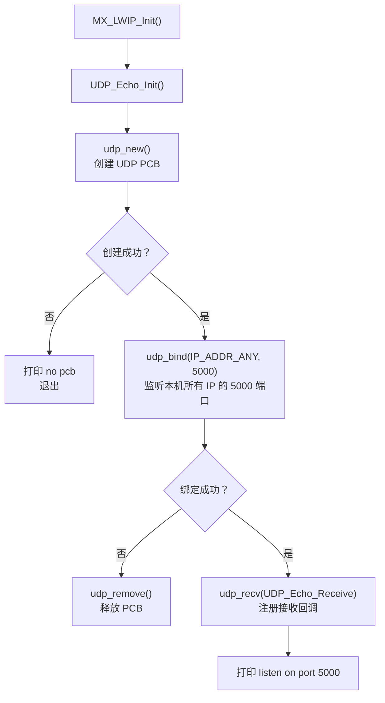
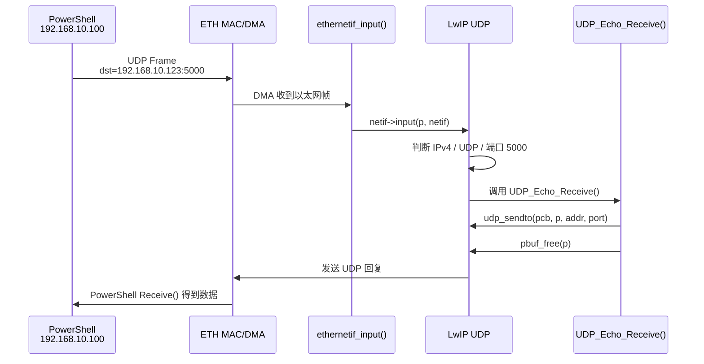
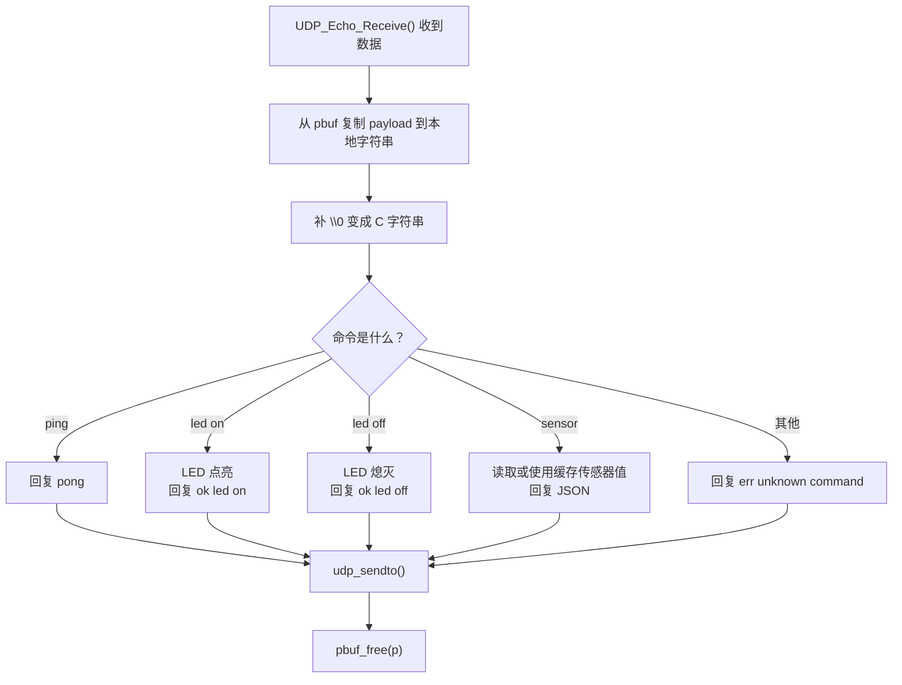

# 阶段 3：UDP 应用协议练习

本阶段目标：不再只验证 UDP Echo 是否能原样回包，而是理解如何基于 UDP 写自己的应用层命令，例如 `led on`、`led off`、`sensor`。

当前工程基础：

- PC 有线网卡：`192.168.10.100/24`
- STM32 开发板：`192.168.10.123/24`
- UDP Echo 端口：`5000`
- 当前 UDP 文件：`Project/LWIP/App/udp_echo.c`
- 当前入口函数：`UDP_Echo_Init()`
- 当前接收回调：`UDP_Echo_Receive()`

测试前先确认串口出现：

```text
[ETH] ready: ping 192.168.10.123, UDP echo port 5000
```

## 1. 今天要掌握什么

学习完成后，你应该能回答：

- UDP 为什么不需要连接？
- `udp_new()` 创建的是什么？
- `udp_bind()` 为什么要绑定端口 `5000`？
- `udp_recv()` 注册的回调什么时候被调用？
- `struct pbuf *p` 里装的是什么？
- 为什么回调最后必须 `pbuf_free(p)`？
- Echo 如何改造成命令协议？

## 2. 当前 UDP Echo 代码结构

当前代码核心如下：

```c
#define UDP_ECHO_PORT 5000U

static struct udp_pcb *UdpEchoPcb;

static void UDP_Echo_Receive(void *arg, struct udp_pcb *pcb, struct pbuf *p,
                             const ip_addr_t *addr, u16_t port)
{
  LWIP_UNUSED_ARG(arg);

  if ((pcb == NULL) || (p == NULL) || (addr == NULL))
  {
    if (p != NULL)
    {
      pbuf_free(p);
    }
    return;
  }

  (void)udp_sendto(pcb, p, addr, port);
  pbuf_free(p);
}
```

这段代码的行为非常简单：

```text
收到什么 UDP 数据
  -> 原样发回给发送方
  -> 释放收到的 pbuf
```

所以 PowerShell 发送：

```text
hello stm32
```

开发板返回：

```text
hello stm32
```

这就是 UDP Echo。

## 3. UDP 初始化调用逻辑

`UDP_Echo_Init()` 只需要在 LwIP 初始化完成后调用一次。

调用流程：



关键点：

- `udp_new()` 创建一个 UDP 控制块，LwIP 用它记录本 UDP 服务的状态。
- `udp_bind(..., 5000)` 表示本服务监听 UDP 端口 `5000`。
- `IP_ADDR_ANY` 表示只要是开发板本机 IP 收到的 UDP 5000，都可以交给这个 PCB。
- `udp_recv()` 不是立即接收数据，而是告诉 LwIP：以后收到数据时调用哪个函数。

## 4. UDP 数据到达时发生什么

当 PC 发 UDP 到 `192.168.10.123:5000` 时，数据路径如下：



这张图里最重要的点是：应用层不是主动去问“有没有 UDP 数据”，而是 LwIP 在收到匹配端口的数据后，主动调用我们注册的回调函数。

## 5. 回调函数参数逐项解释

```c
static void UDP_Echo_Receive(void *arg, struct udp_pcb *pcb, struct pbuf *p,
                             const ip_addr_t *addr, u16_t port)
```

| 参数 | 含义 | 在当前 Echo 里的作用 |
| --- | --- | --- |
| `arg` | 注册回调时传入的用户参数 | 当前传的是 `NULL`，所以没有使用 |
| `pcb` | 当前 UDP 服务的控制块 | `udp_sendto()` 回包时要用它 |
| `p` | 收到的数据缓冲区 | 里面装着 PC 发来的 UDP payload |
| `addr` | 发送方 IP 地址 | 回包时发回这个 IP |
| `port` | 发送方 UDP 源端口 | 回包时发回这个端口 |

注意：`port` 不是开发板的 `5000`，而是 PC 随机分配的临时源端口。开发板必须回到这个源端口，PowerShell 的 `Receive()` 才能收到。

## 6. pbuf 是什么

`pbuf` 是 LwIP 里的数据缓冲结构。可以先把它理解成：

```text
pbuf = 一段网络数据 + 长度信息 + 链表关系 + 引用计数
```

常用字段：

| 字段 | 含义 |
| --- | --- |
| `p->payload` | 指向实际数据内容 |
| `p->len` | 当前这个 pbuf 里的数据长度 |
| `p->tot_len` | 整个 pbuf 链的总长度 |
| `p->next` | 下一个 pbuf，可能为空 |

在简单 UDP Echo 测试里，`hello stm32` 通常就在 `p->payload` 里，长度是 `11`。

但是写正式应用时要注意：`pbuf` 可能是链表，不能永远假设所有数据都在第一个 `pbuf` 里。当前命令很短，可以先按简单场景学习，后面再处理跨 pbuf 的情况。

## 7. 为什么必须 pbuf_free

收到 UDP 数据后，LwIP 把一个 `pbuf` 交给应用回调。应用处理完以后，必须释放：

```c
pbuf_free(p);
```

如果忘记释放，会出现：

```text
前几次 UDP 正常
跑一会儿以后收不到包
内存池或 RX buffer 被耗尽
```

所以 UDP 回调里要养成习惯：

```text
只要 p != NULL
最终必须有且只有一次 pbuf_free(p)
```

当前代码里异常路径也做了释放：

```c
if ((pcb == NULL) || (p == NULL) || (addr == NULL))
{
  if (p != NULL)
  {
    pbuf_free(p);
  }
  return;
}
```

这是对的。

## 8. Echo 如何变成命令协议

Echo 的逻辑是：

```text
收到什么 -> 回什么
```

命令协议的逻辑是：

```text
收到文本命令
  -> 判断命令内容
  -> 执行动作
  -> 返回执行结果
```

第一版可以设计成这样：

| PC 发送 | 开发板动作 | 开发板返回 |
| --- | --- | --- |
| `ping` | 不操作硬件 | `pong` |
| `led on` | 点亮 LED | `ok led on` |
| `led off` | 熄灭 LED | `ok led off` |
| `sensor` | 返回当前传感器数据 | `{"temp":25.3,"humi":60.0,"light":1234}` |
| 其他内容 | 不执行动作 | `err unknown command` |

这就是一个很小的应用层协议。

## 9. 命令处理流程图



为什么要复制到本地字符串？

- UDP payload 不一定自带字符串结束符 `\0`。
- C 的 `strcmp()`、`strncmp()` 需要字符串结束符。
- 直接把 `p->payload` 当字符串用，有越界读取风险。

## 10. 建议代码结构

不要把所有逻辑都堆进 `UDP_Echo_Receive()`。更清晰的结构是：

```text
UDP_Echo_Receive()
  -> UDP_CopyPayloadToText()
  -> UDP_HandleCommand()
  -> udp_sendto()
  -> pbuf_free()
```

示意代码：

```c
static void UDP_HandleCommand(const char *cmd, char *reply, size_t reply_size)
{
  if (strcmp(cmd, "ping") == 0)
  {
    snprintf(reply, reply_size, "pong");
  }
  else if (strcmp(cmd, "led on") == 0)
  {
    LED0(0);
    snprintf(reply, reply_size, "ok led on");
  }
  else if (strcmp(cmd, "led off") == 0)
  {
    LED0(1);
    snprintf(reply, reply_size, "ok led off");
  }
  else if (strcmp(cmd, "sensor") == 0)
  {
    snprintf(reply, reply_size,
             "{\"temp\":25.3,\"humi\":60.0,\"light\":1234}");
  }
  else
  {
    snprintf(reply, reply_size, "err unknown command");
  }
}
```

注意：上面 LED 宏的电平只是示意，真正改程序时要以当前工程 LED 驱动为准。

## 11. PowerShell 测试模板

可以把要发送的内容改成变量：

```powershell
$cmd = "ping"
$u = New-Object System.Net.Sockets.UdpClient
$u.Client.Bind([Net.IPEndPoint]::new([Net.IPAddress]::Parse("192.168.10.100"),0))
$bytes = [Text.Encoding]::ASCII.GetBytes($cmd)
$u.Send($bytes,$bytes.Length,"192.168.10.123",5000)
$remote = [Net.IPEndPoint]::new([Net.IPAddress]::Any,0)
[Text.Encoding]::ASCII.GetString($u.Receive([ref]$remote))
$u.Close()
```

期望结果：

```text
pong
```

本次实际测试结果：

```text
PS C:\WINDOWS\system32> $cmd = "ping"
$u = New-Object System.Net.Sockets.UdpClient
$u.Client.Bind([Net.IPEndPoint]::new([Net.IPAddress]::Parse("192.168.10.100"),0))
$bytes = [Text.Encoding]::ASCII.GetBytes($cmd)
$u.Send($bytes,$bytes.Length,"192.168.10.123",5000)
$remote = [Net.IPEndPoint]::new([Net.IPAddress]::Any,0)
[Text.Encoding]::ASCII.GetString($u.Receive([ref]$remote))
$u.Close()
4
pong
```

逐项看这次结果：

| 输出内容 | 含义 |
| --- | --- |
| `$cmd = "ping"` | PC 这次发送的 UDP 应用命令是 `ping`。 |
| `$u.Send(...)` 后面的 `4` | `ping` 一共 4 个 ASCII 字节，说明 PC 成功把 4 字节 UDP 数据交给系统发送。 |
| `pong` | 开发板没有再原样 Echo `ping`，而是进入 `UDP_HandleCommand()`，识别命令后返回了新内容 `pong`。 |

这个结果说明 UDP 已经从“原样回显测试”进入“应用命令协议测试”。当前路径是：

```text
PC 发送 ping
  -> LwIP 收到 UDP 5000
  -> UDP_Echo_Receive()
  -> UDP_CopyPayloadToText()
  -> UDP_HandleCommand()
  -> 回复 pong
```

测试 `sensor`：

```powershell
$cmd = "sensor"
```

期望结果：

```json
{"temp":25.3,"humi":60.0,"light":1234}
```

## 12. 今天的实验安排

### 实验 1：复测 UDP Echo

目标：确认第三天开始前，基础 UDP 仍然通。

发送：

```powershell
$cmd = "hello stm32"
```

成功标准：

```text
hello stm32
```

### 实验 2：设计命令表

目标：先不改代码，明确应用协议。

建议命令：

```text
ping
led on
led off
sensor
```

### 实验 3：实现 ping 命令

目标：把 Echo 改成最简单的命令处理。

输入：

```text
ping
```

输出：

```text
pong
```

这是最安全的第一步，不涉及 LED 和传感器。

### 实验 4：实现 sensor 命令

目标：先返回固定 JSON，后续再接入真实传感器缓存。

输入：

```text
sensor
```

输出：

```json
{"temp":25.3,"humi":60.0,"light":1234}
```

### 实验 5：实现 LED 命令

目标：用 UDP 控制板载 LED。

输入：

```text
led on
led off
```

输出：

```text
ok led on
ok led off
```

这一步要结合当前工程 LED 驱动确认 LED 的有效电平。

## 13. 五个实验的实际验证结果

本次验证使用同一个 PowerShell UDP 客户端模板，只修改 `$cmd` 的内容。

### 实验 1：复测 UDP Echo

输入：

```powershell
$cmd = "hello stm32"
```

实际输出：

```text
11
hello stm32
```

解释：

- `11` 表示 PC 成功发送了 11 个 ASCII 字节。
- `hello stm32` 表示开发板仍然支持基础 Echo 测试，收到该文本后原样返回。

### 实验 2：命令表验证

本阶段实际可用命令如下：

| 命令 | 返回 | 作用 |
| --- | --- | --- |
| `hello stm32` | `hello stm32` | 复测基础 UDP Echo |
| `ping` | `pong` | 验证最小命令解析 |
| `sensor` | `{"temp":25.3,"humi":60.0,"light":1234}` | 返回固定 JSON 风格传感器数据 |
| `led on` | `ok led on` | 点亮 LED0 |
| `led off` | `ok led off` | 熄灭 LED0 |
| `led toggle` | `ok led toggle` | 翻转 LED0 状态，便于观察 |

### 实验 3：ping 命令

输入：

```powershell
$cmd = "ping"
```

实际输出：

```text
4
pong
```

解释：

- `4` 表示 PC 发送了 `ping` 这 4 个字节。
- `pong` 表示开发板进入 `UDP_HandleCommand()` 后识别了 `ping` 命令，并返回自定义响应。

### 实验 4：sensor 命令

输入：

```powershell
$cmd = "sensor"
```

实际输出：

```text
6
{"temp":25.3,"humi":60.0,"light":1234}
```

解释：

- `6` 表示 PC 发送了 `sensor` 这 6 个字节。
- 返回的 JSON 当前是固定示例数据，用来验证应用层协议格式；后续可以替换成真实传感器缓存值。

### 实验 5：LED 命令

输入：

```powershell
$cmd = "led on"
```

实际输出：

```text
6
ok led on
```

输入：

```powershell
$cmd = "led off"
```

实际输出：

```text
7
ok led off
```

输入：

```powershell
$cmd = "led toggle"
```

实际输出：

```text
10
ok led toggle
```

解释：

- `led on`、`led off`、`led toggle` 已经能通过 UDP 控制 LED0。
- `LED_On()`、`LED_Off()`、`LED_Toggle()` 会通过 LED 驱动处理板级有效电平，UDP 层不用直接写 GPIO 高低电平。
- 连续发送两次 `led toggle`，LED0 状态会翻转两次，最终回到原来的状态。

## 14. 本次串口回显分析

本次串口关键内容：

```text
[ETH] TX ARP request len=42 tot=42 src=00:80:E1:00:00:00 dst=FF:FF:FF:FF:FF:FF sender=192.168.10.123 target=192.168.10.123
[ETH] link up: 10M half duplex
[ETH] ready: ping 192.168.10.123, UDP echo port 5000

[ETH] TX ARP request len=42 tot=42 src=00:80:E1:00:00:00 dst=FF:FF:FF:FF:FF:FF sender=192.168.10.123 target=192.168.10.100
[ETH] RX ARP reply len=60 tot=60 src=2C:16:DB:A0:74:F6 dst=00:80:E1:00:00:00 sender=192.168.10.100 target=192.168.10.123
```

逐项解释：

| 串口内容 | 含义 |
| --- | --- |
| `sender=192.168.10.123 target=192.168.10.123` | 开发板启动后发送 gratuitous ARP，用来声明自己的 IP/MAC。 |
| `[ETH] link up: 10M half duplex` | PHY 链路已建立，当前协商为 10M 半双工。 |
| `[ETH] ready... UDP echo port 5000` | LwIP 和 UDP 5000 服务已准备好。 |
| `sender=192.168.10.123 target=192.168.10.100` | 开发板准备向 PC 回复 UDP 数据前，需要知道 PC `192.168.10.100` 的 MAC，于是主动发 ARP request。 |
| `RX ARP reply ... src=2C:16:DB:A0:74:F6` | PC 回复了自己的 MAC 地址，开发板知道后就可以把 UDP 响应发回 PC。 |

注意：串口没有逐条打印 UDP payload 是正常的。当前日志重点打印 ARP、ICMP 和链路状态；UDP 应用是否成功，主要看 PowerShell 是否收到预期返回值。

本次五个实验全部成功，说明：

```text
PC UDP 发送
  -> STM32 LwIP UDP 5000
  -> UDP_Echo_Receive()
  -> UDP_CopyPayloadToText()
  -> UDP_HandleCommand()
  -> 开发板按命令返回结果
```

## 15. 使用 SSCOM/网络调试助手测试 UDP

除了 PowerShell，也可以使用 SSCOM 这类串口/网络调试助手的 UDP 功能测试。它更适合日常手动调试，因为发送区直接输入文本命令即可。

推荐配置：

| 设置项 | 推荐值 |
| --- | --- |
| 通信类型 | `UDP` |
| 本地 IP | `192.168.10.100` |
| 本地端口 | 任意未占用端口，例如 `777` |
| 远程 IP | `192.168.10.123` |
| 远程端口 | `5000` |
| 发送格式 | 文本 / ASCII |
| HEX 发送 | 不勾选 |
| 加回车换行 | 不勾选，除非程序专门处理 `\r\n` |

发送区直接输入命令：

```text
ping
hello stm32
sensor
led on
led off
led toggle
```

本次 SSCOM 实测结果：

```text
发送 ping
返回 pong

发送 hello stm32
返回 hello stm32

发送 sensor
返回 {"temp":25.3,"humi":60.0,"light":1234}

发送 led on
返回 ok led on

发送 led off
返回 ok led off

发送 led toggle
返回 ok led toggle
```

这个方法和 PowerShell 本质一样，都是从 PC 向：

```text
192.168.10.123:5000
```

发送 UDP 文本数据。区别只是工具界面不同：

| 工具 | 优点 |
| --- | --- |
| PowerShell | 能精确指定源 IP，适合排查多网卡问题 |
| SSCOM/网络调试助手 | 操作直观，适合反复手动发送命令 |

注意：如果电脑有多个网卡，SSCOM 里本地 IP 要选有线网卡 `192.168.10.100`。如果仍然依赖静态 ARP，也要先确认：

```powershell
arp -a
```

里面存在：

```text
192.168.10.123  00-80-e1-00-00-00
```

## 16. 常见问题

### PowerShell 卡在 Receive 不返回

说明 PC 没收到开发板 UDP 回复。可能原因：

- 开发板还没出现 `[ETH] ready`
- PC 有线 IP 不是 `192.168.10.100`
- 目标 IP 或端口写错
- UDP 回调没有被注册
- 回调里没有调用 `udp_sendto()`
- `MX_LWIP_Process()` 没有持续执行

### PowerShell 显示发送字节数，但没有回复

例如只显示：

```text
11
```

说明 PC 侧数据已经交给系统发送，但不能证明开发板回包成功。必须看到返回字符串才算 UDP Echo 成功。

### 串口没有 UDP 内容

当前工程主要打印 ARP 和链路状态。UDP 应用层是否成功，优先看 PowerShell 是否收到回包。

如果需要观察 UDP 内容，可以后续在 `UDP_Echo_Receive()` 里加打印，例如：

```c
printf("[UDP] rx len=%u from port=%u\r\n", (unsigned int)p->tot_len, (unsigned int)port);
```

## 17. 本阶段总结

UDP 应用开发的核心不是“连接”，而是“收到一个包就处理一个包”。

完整路径可以记成：

```text
PC 发 UDP 文本命令
  -> LwIP 根据端口 5000 找到 UDP PCB
  -> 调用 UDP_Echo_Receive()
  -> 应用解析命令
  -> udp_sendto() 返回结果
  -> pbuf_free() 释放收到的包
```

今天最重要的编程习惯：

- 收到的 payload 先复制，再当字符串解析。
- 每个收到的 `pbuf` 最后都要释放。
- 先实现 `ping -> pong`，再扩展 LED 和 sensor。
- 每加一个命令，都要在 PC 侧有明确输入和期望输出。
