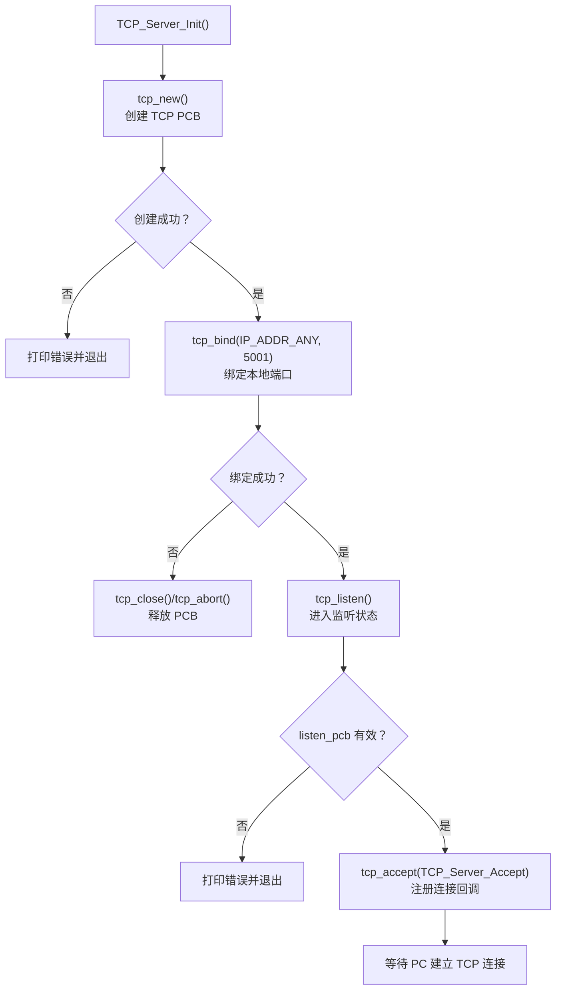
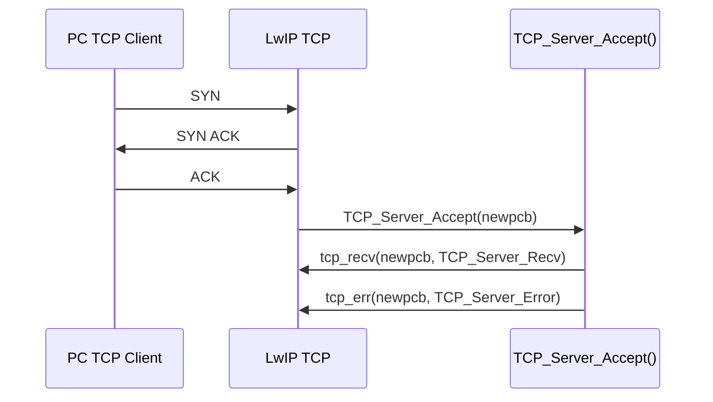
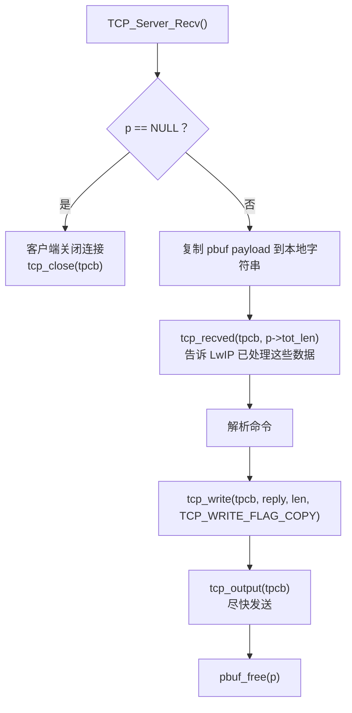
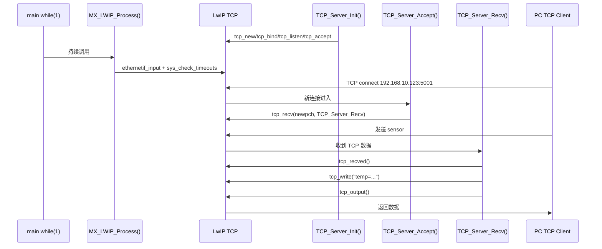
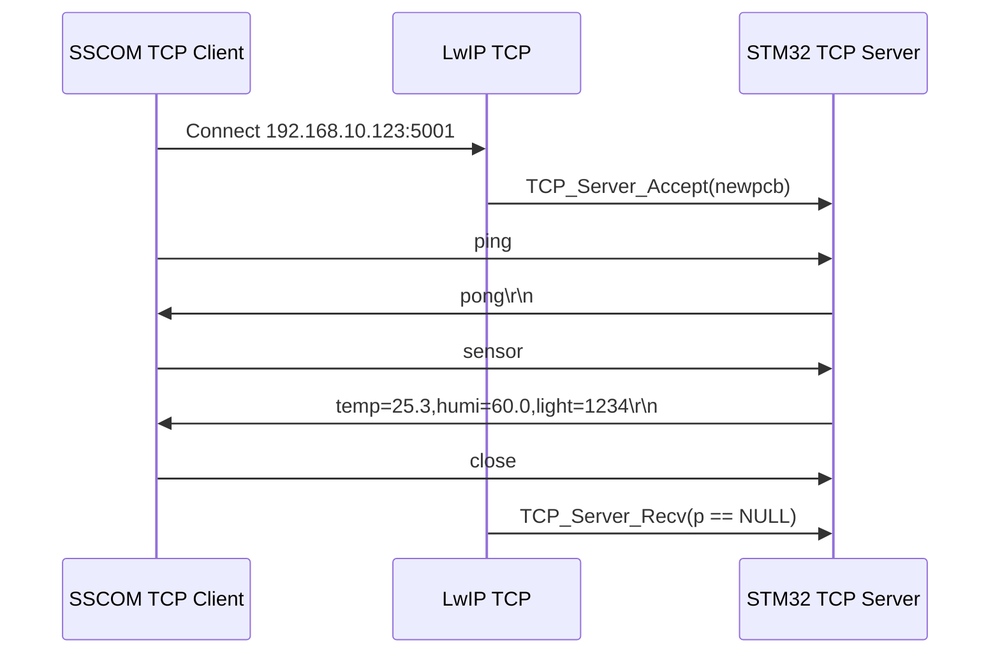

# 阶段 4：TCP Server 练习

本阶段目标：让 STM32 开发板作为 TCP 服务器，PC 主动连接开发板，并通过连接发送命令、接收回复。

当前基础：

- PC 有线网卡：`192.168.10.100/24`
- STM32 开发板：`192.168.10.123/24`
- UDP 命令端口：`5000`
- 本阶段建议 TCP 端口：`5001`
- LwIP 运行模式：裸机 `NO_SYS=1`
- 主循环仍然必须持续调用：`MX_LWIP_Process()`

建议先确认：

```text
[ETH] link up
[ETH] ready: ping 192.168.10.123, UDP echo port 5000
[ETH] arp announce complete: 5 attempts, 0 failures
```

## 1. 今天要掌握什么

学习完成后，你应该能回答：

- TCP 和 UDP 最大区别是什么？
- `tcp_new()` 创建的是什么？
- `tcp_bind()` 和 `tcp_listen()` 分别做什么？
- `tcp_accept()` 注册的回调什么时候被调用？
- `tcp_recv()` 注册的回调什么时候被调用？
- 为什么收到 TCP 数据后要调用 `tcp_recved()`？
- `tcp_write()` 和 `tcp_output()` 的关系是什么？
- TCP 客户端断开时，服务端应该怎么处理？

## 2. UDP 和 TCP 的核心区别

UDP 是“一包一处理”：

```text
PC 发一个 UDP 包
  -> 开发板收到
  -> 回一个 UDP 包
  -> 这次通信结束
```

TCP 是“先建立连接，再在连接里收发数据”：

```text
PC 连接 STM32:5001
  -> 三次握手建立连接
  -> PC 发送 sensor
  -> STM32 返回数据
  -> 连接可以继续保持，也可以关闭
```

对比：

| 项目 | UDP | TCP |
| --- | --- | --- |
| 是否连接 | 无连接 | 有连接 |
| 数据边界 | 一次 `udp_recv` 对应一次数据报 | 字节流，没有天然命令边界 |
| 可靠性 | 不保证到达 | 有确认、重传、顺序控制 |
| 状态复杂度 | 低 | 高 |
| 适合场景 | 简单命令、局域网控制、广播 | HTTP、MQTT、长连接、可靠传输 |

## 3. TCP Server 初始化流程

TCP Server 的初始化通常是：

```c
pcb = tcp_new();
tcp_bind(pcb, IP_ADDR_ANY, 5001);
listen_pcb = tcp_listen(pcb);
tcp_accept(listen_pcb, TCP_Server_Accept);
```

流程图：



这一步只是“开门营业”，还没有客户端连接进来。

## 4. PC 连接进来时发生什么

当 PC 连接：

```text
192.168.10.123:5001
```

LwIP 会完成 TCP 三次握手，然后调用 `tcp_accept()` 注册的回调。



`newpcb` 很重要：它代表这一个客户端连接。

监听用的 `listen_pcb` 只负责等新连接；真正收发数据的是 `newpcb`。

## 5. 收到 TCP 数据时发生什么

当 PC 通过已经建立的连接发送文本：

```text
sensor
```

LwIP 会调用：

```c
TCP_Server_Recv(void *arg, struct tcp_pcb *tpcb, struct pbuf *p, err_t err)
```

流程图：



注意两个关键点：

1. `p == NULL` 表示对端关闭连接，不是收到空字符串。
2. 收到有效数据后要调用：

```c
tcp_recved(tpcb, p->tot_len);
```

这会更新 TCP 接收窗口。否则对端继续发送时可能被窗口限制。

## 6. TCP 的数据不是一条命令一个包

UDP 里，PC 发一次：

```text
sensor
```

开发板通常一次回调就收到完整 `sensor`。

TCP 是字节流，可能出现：

```text
一次回调收到 sensor
```

也可能出现：

```text
第一次收到 sen
第二次收到 sor
```

或者一次收到多条：

```text
sensor
ping
```

所以严谨的 TCP 协议通常要定义命令边界，例如：

```text
sensor\n
ping\n
```

本阶段第一版为了简单，可以先用短命令测试，并假设一次 `recv` 收到一条完整命令。等后面做 HTTP/MQTT 时，再处理更严格的流式解析。

## 7. TCP 命令设计

为了和 UDP 阶段对应，第一版 TCP Server 可以支持：

| PC 发送 | STM32 返回 |
| --- | --- |
| `ping` | `pong\r\n` |
| `sensor` | `temp=25.3,humi=60.0,light=1234\r\n` |
| `hello stm32` | `hello stm32\r\n` |
| 其他内容 | `err unknown command\r\n` |

为什么 TCP 回复建议带 `\r\n`？

- 网络调试助手更容易显示成一行。
- 以后做简单文本协议时，`\r\n` 可以作为一条消息结束标志。
- HTTP 协议本身也大量使用 `\r\n`。

## 8. TCP Server 调用逻辑总图



## 9. PC 侧测试方式

### PowerShell TcpClient

连接：

```powershell
$client = [Net.Sockets.TcpClient]::new()
$client.Connect("192.168.10.123", 5001)
$stream = $client.GetStream()
```

发送命令：

```powershell
$cmd = "ping"
$bytes = [Text.Encoding]::ASCII.GetBytes($cmd)
$stream.Write($bytes, 0, $bytes.Length)
```

接收回复：

```powershell
$buf = New-Object byte[] 256
$n = $stream.Read($buf, 0, $buf.Length)
[Text.Encoding]::ASCII.GetString($buf, 0, $n)
```

关闭：

```powershell
$stream.Close()
$client.Close()
```

### SSCOM/网络调试助手

也可以使用网络调试助手：

| 设置项 | 推荐值 |
| --- | --- |
| 协议 | `TCP Client` |
| 本地 IP | `192.168.10.100` |
| 远程 IP | `192.168.10.123` |
| 远程端口 | `5001` |
| 发送格式 | 文本 / ASCII |

连接成功后，发送区输入：

```text
ping
sensor
hello stm32
```

## 10. 今天的实验安排

### 实验 1：复习 UDP 和 TCP 差异

目标：明确 UDP 是无连接，TCP 是有连接。

需要能说出：

```text
UDP 收到一包处理一包
TCP 先 accept 连接，再在连接上 recv/write
```

### 实验 2：设计 TCP Server 文件

建议新增：

```text
Project/LWIP/App/tcp_server.c
Project/LWIP/App/tcp_server.h
```

并在 `MX_LWIP_Init()` 里调用：

```c
TCP_Server_Init();
```

### 实验 3：实现 TCP 监听

目标：串口看到：

```text
[TCP] server listen on port 5001
```

PC 能建立 TCP 连接。

### 实验 4：实现 ping 命令

目标：

```text
PC -> ping
STM32 -> pong
```

### 实验 5：实现 sensor 命令

目标：

```text
PC -> sensor
STM32 -> temp=25.3,humi=60.0,light=1234
```

## 11. 常见问题

### TCP 连接不上

先确认：

- ping 是否通。
- `arp -a` 是否有开发板。
- 串口是否出现 link up。
- TCP Server 是否已经初始化并监听 `5001`。

### TCP 连接上但收不到回复

检查：

- `tcp_recv()` 是否注册到 `newpcb`。
- `TCP_Server_Recv()` 是否被调用。
- 是否调用了 `tcp_write()`。
- 是否调用了 `tcp_output()`。
- 是否忘记 `pbuf_free(p)`。

### 收到的数据不完整

这是 TCP 字节流特性，不一定是 bug。

后续严谨做法是用 `\n` 或 `\r\n` 作为命令结束符，并在连接状态里缓存未处理完的数据。

## 12. 本阶段总结

TCP Server 的核心可以记成：

```text
tcp_new()
  -> tcp_bind()
  -> tcp_listen()
  -> tcp_accept()
  -> tcp_recv()
  -> tcp_recved()
  -> tcp_write()
  -> tcp_output()
```

UDP 阶段你写的是“包处理函数”，TCP 阶段你要开始写“连接处理逻辑”。这是后续 HTTP 和 MQTT 的基础。
## 13. TCP Server 和 SSCOM Client 实测记录

本次实验中，STM32 是 TCP Server，监听地址和端口为：

```text
192.168.10.123:5001
```

SSCOM 网络调试助手作为 TCP Client，主动连接 STM32。

### 13.1 STM32 Server 端启动信息

串口启动日志：

```text
[ETH] PHY reset start
[ETH] PHY reset released
[PHY] scan start
[PHY] found addr=0 PHYID=0x0007C0F1
[ETH] LwIP init
[ETH] IP=192.168.10.123 NETMASK=255.255.255.0 GW=192.168.10.1
[UDP] echo server listen on port 5000
[TCP] command server listen on port 5001
```

逐条说明：

| 日志 | 含义 |
| --- | --- |
| `[ETH] PHY reset start` | 开始复位以太网 PHY 芯片。 |
| `[ETH] PHY reset released` | PHY 复位释放，硬件可以开始工作。 |
| `[PHY] scan start` | 开始扫描 PHY 地址。 |
| `[PHY] found addr=0 PHYID=0x0007C0F1` | 找到 PHY，地址为 0，说明 MDIO/MDC 通信正常。 |
| `[ETH] LwIP init` | LwIP 协议栈开始初始化。 |
| `[ETH] IP=192.168.10.123 ...` | STM32 有线网口使用静态 IP。 |
| `[UDP] echo server listen on port 5000` | UDP 命令服务已经监听 5000 端口。 |
| `[TCP] command server listen on port 5001` | TCP 命令服务已经监听 5001 端口。 |

看到 `[TCP] command server listen on port 5001`，只能说明 TCP Server 已经创建并进入监听状态，还不代表已经有客户端连接。

### 13.2 链路和 ping 验证

串口日志：

```text
[ETH] link up: 10M half duplex
[ETH] ready: ping 192.168.10.123, UDP echo port 5000
[ETH] RX IPv4 ICMP type=8 len=74 tot=74 src=192.168.10.100 dst=192.168.10.123
[ETH] TX IPv4 ICMP type=0 len=74 tot=74 src=192.168.10.123 dst=192.168.10.100
[ETH] arp announce complete: 5 attempts, 0 failures
```

逐条说明：

| 日志 | 含义 |
| --- | --- |
| `[ETH] link up: 10M half duplex` | 网线链路已建立，当前协商为 10M 半双工。 |
| `[ETH] ready...` | 当前以太网应用层服务已经准备好。 |
| `RX IPv4 ICMP type=8` | STM32 收到 PC 发来的 ICMP Echo Request，也就是 ping 请求。 |
| `TX IPv4 ICMP type=0` | STM32 回复 ICMP Echo Reply，也就是 ping 回复。 |
| `arp announce complete: 5 attempts, 0 failures` | 自动 ARP 宣告流程完成，用来帮助 PC 建立或刷新 ARP 表项。 |

这里的 ICMP 日志说明 ping 流程已经经过 STM32 的以太网收包、LwIP 协议栈处理、再由 STM32 发包回复。

### 13.3 TCP Client 连接进入

SSCOM 点击连接后，STM32 串口打印：

```text
[TCP] client connected
```

这条日志来自 `TCP_Server_Accept()`。

含义是：

```text
PC TCP Client -> 连接 192.168.10.123:5001
LwIP 完成 TCP 三次握手
LwIP 调用 TCP_Server_Accept()
程序给 newpcb 注册 tcp_recv() 和 tcp_err()
```

注意：TCP Server 监听用的 PCB 只负责等待连接。真正收发数据的是 accept 回调里拿到的 `newpcb`。

### 13.4 TCP 命令收发结果

SSCOM Client 端测试记录：

| Client 发送 | Client 收到 | STM32 串口日志 |
| --- | --- | --- |
| `ping` | `pong` | `[TCP] cmd="ping" reply="pong"` |
| `sensor` | `temp=25.3,humi=60.0,light=1234` | `[TCP] cmd="sensor" reply="temp=25.3,humi=60.0,light=1234"` |
| `hello stm32` | `hello stm32` | `[TCP] cmd="hello stm32" reply="hello stm32"` |
| `ni hao yuanbiaoyu` | `err unknown command` | `[TCP] cmd="ni hao yuanbiaoyu" reply="err unknown command"` |

串口完整片段：

```text
[TCP] cmd="ping" reply="pong
"

[TCP] cmd="sensor" reply="temp=25.3,humi=60.0,light=1234
"

[TCP] cmd="hello stm32" reply="hello stm32
"

[TCP] cmd="ni hao yuanbiaoyu" reply="err unknown command
"
```

这里串口里 `reply` 看起来分成两行，是因为 TCP 回复字符串末尾带有 `\r\n`。也就是说，实际回复是：

```text
pong\r\n
temp=25.3,humi=60.0,light=1234\r\n
hello stm32\r\n
err unknown command\r\n
```

`\r\n` 的作用是让网络调试助手按一行一条消息显示。它不是乱码，也不是多发了一条数据。

### 13.5 Client 关闭连接

最后串口打印：

```text
[TCP] client closed
```

这条日志来自 `TCP_Server_Recv()` 中的：

```c
if (p == NULL)
```

在 LwIP TCP raw API 里，`p == NULL` 表示对端关闭了 TCP 连接。此时程序会调用 `TCP_Server_Close()`，清理回调并关闭当前连接。

### 13.6 本次实验说明了什么

这次实验完整验证了 TCP Server 的基本链路：



和 UDP 阶段相比，这次最重要的变化是：TCP 不是“来一个包处理一个包”，而是先建立连接，再在连接里反复收发数据。
