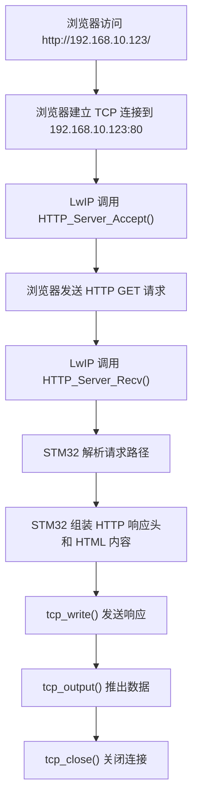
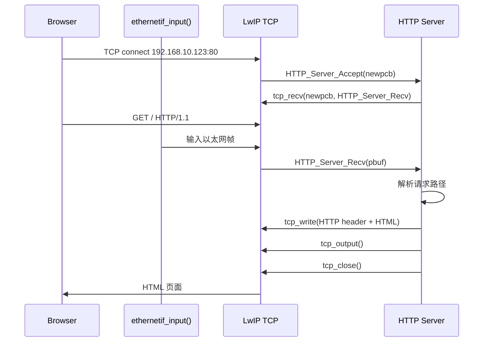
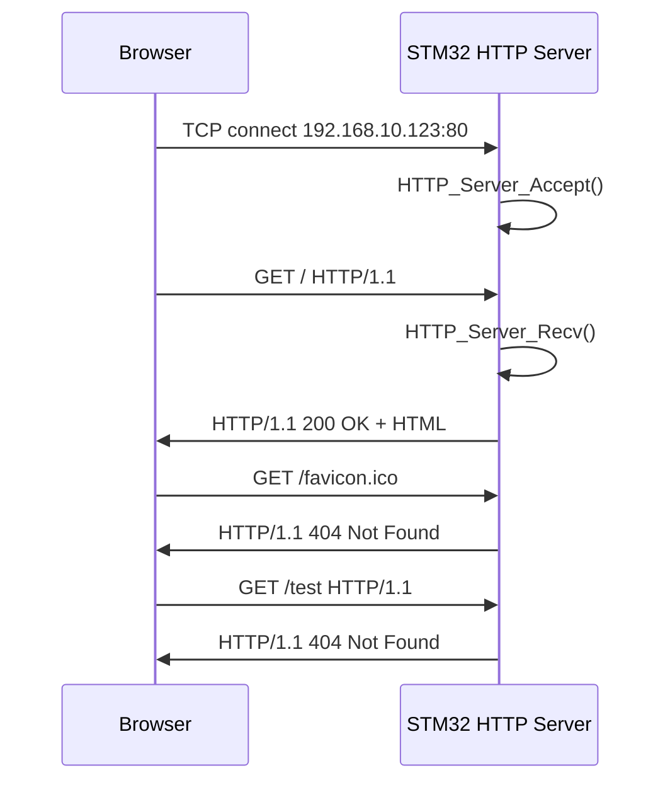

# 阶段 5：简单 HTTP 页面

本阶段目标：让浏览器访问 STM32 开发板，并看到一个最小网页。

当前基础：

- PC 有线网卡：`192.168.10.100/24`
- STM32 ETH：`192.168.10.123/24`
- UDP 命令端口：`5000`
- TCP 命令端口：`5001`
- 本阶段建议 HTTP 端口：`80`
- LwIP 模式：裸机 `NO_SYS=1`
- 主循环仍然必须持续调用：`MX_LWIP_Process()`

浏览器访问目标：

```text
http://192.168.10.123/
```

## 1. 这一阶段要学什么

学完后，你应该能回答：

- 浏览器访问 `http://192.168.10.123/` 时，底层发生了什么？
- HTTP 和 TCP 是什么关系？
- HTTP 请求报文长什么样？
- HTTP 响应报文必须包含哪些内容？
- 为什么 HTTP Server 本质上也是一个 TCP Server？
- STM32 收到浏览器请求后，应该什么时候关闭 TCP 连接？

一句话先记住：

```text
HTTP = 跑在 TCP 连接上的文本协议
```

## 2. 从 TCP Server 过渡到 HTTP Server

上一阶段我们做的 TCP Server 是：

```text
PC -> ping
STM32 -> pong
```

HTTP Server 本质上也是类似流程，只是 PC 端换成浏览器，命令格式换成 HTTP 请求：

```text
浏览器 -> GET / HTTP/1.1
STM32  -> HTTP/1.1 200 OK + HTML 页面
```

调用关系可以理解为：



## 3. 浏览器发来的 HTTP 请求

当浏览器访问：

```text
http://192.168.10.123/
```

STM32 通常会收到类似这样的文本：

```http
GET / HTTP/1.1
Host: 192.168.10.123
Connection: keep-alive
User-Agent: ...
Accept: ...
```

第一行最重要：

```http
GET / HTTP/1.1
```

含义：

| 字段 | 含义 |
| --- | --- |
| `GET` | 浏览器想读取资源。 |
| `/` | 请求根路径，也就是首页。 |
| `HTTP/1.1` | 使用 HTTP/1.1 协议格式。 |

第一版 HTTP Server 可以先只识别：

```text
GET /
```

其他请求统一返回简单错误页面。

## 4. STM32 应该返回什么

最小 HTTP 响应由两部分组成：

```text
响应头

响应体
```

注意：响应头和响应体之间必须有一个空行，也就是连续的：

```text
\r\n\r\n
```

一个最小网页响应可以写成：

```http
HTTP/1.1 200 OK
Content-Type: text/html
Connection: close

<!doctype html>
<html>
<body>
  <h1>STM32 Sensor Dashboard</h1>
  <p>Temperature: 25.3</p>
  <p>Humidity: 60.0</p>
  <p>Light: 1234</p>
</body>
</html>
```

实际 C 字符串中要用 `\r\n`：

```c
"HTTP/1.1 200 OK\r\n"
"Content-Type: text/html\r\n"
"Connection: close\r\n"
"\r\n"
"<!doctype html>..."
```

## 5. HTTP 响应头逐条说明

| 响应头 | 含义 |
| --- | --- |
| `HTTP/1.1 200 OK` | 状态行，表示请求成功。 |
| `Content-Type: text/html` | 告诉浏览器响应体是 HTML 页面。 |
| `Connection: close` | 告诉浏览器：发完这次页面后，STM32 会关闭 TCP 连接。 |
| 空行 `\r\n` | 表示响应头结束，后面开始是网页内容。 |

第一版建议使用 `Connection: close`，因为这样 STM32 不需要长期维护浏览器连接，逻辑最简单。

## 6. HTTP Server 和上一阶段 TCP Server 的对比

| 项目 | TCP 命令 Server | HTTP Server |
| --- | --- | --- |
| 监听端口 | `5001` | `80` |
| Client | SSCOM 或 PowerShell | 浏览器 |
| 收到的数据 | `ping`、`sensor` | `GET / HTTP/1.1...` |
| 返回的数据 | `pong\r\n` | `HTTP/1.1 200 OK...HTML...` |
| 是否基于 TCP | 是 | 是 |
| 是否要处理连接关闭 | 是 | 是 |

所以，HTTP 不是全新的底层东西，而是在 TCP Server 上增加了“请求格式”和“响应格式”。

## 7. 程序调用逻辑图



## 8. 第一版实验目标

### 实验 1：浏览器访问首页

目标：

```text
浏览器访问 http://192.168.10.123/
看到 STM32 Sensor Dashboard 页面
```

页面内容先写死：

```text
Temperature: 25.3
Humidity: 60.0
Light: 1234
```

### 实验 2：串口打印 HTTP 请求

目标：浏览器访问时，串口能看到：

```text
[HTTP] client connected
[HTTP] request: GET /
[HTTP] response sent
[HTTP] client closed
```

这样可以把浏览器动作和 STM32 程序回调对应起来。

### 实验 3：访问不存在路径

浏览器访问：

```text
http://192.168.10.123/test
```

STM32 返回：

```text
HTTP/1.1 404 Not Found
```

页面显示：

```text
404 Not Found
```

## 9. 本阶段先不做什么

第一版先不做：

- CSS 美化
- JavaScript 自动刷新
- 多连接并发
- 大文件分段发送
- gzip 压缩
- chunked 编码
- WebSocket

原因：这些都会增加状态管理复杂度。当前阶段重点是先理解：

```text
TCP 收到浏览器请求 -> 组装 HTTP 响应 -> 浏览器显示页面
```

## 10. 常见问题

### 浏览器打不开

先确认：

```powershell
ping -S 192.168.10.100 192.168.10.123
arp -a
```

再确认串口是否有：

```text
[HTTP] server listen on port 80
```

### 浏览器一直转圈

常见原因：

- 没有发送完整 HTTP 响应头。
- 响应头和响应体之间缺少 `\r\n\r\n`。
- 没有 `tcp_output()`。
- 使用 `Connection: close` 后没有关闭连接。

### 浏览器显示源码或乱码

检查：

```text
Content-Type: text/html
```

如果返回 JSON，则应使用：

```text
Content-Type: application/json
```

## 11. 本阶段总结

HTTP Server 的核心可以记成：

```text
tcp_new()
  -> tcp_bind(port 80)
  -> tcp_listen()
  -> tcp_accept()
  -> tcp_recv(GET request)
  -> tcp_write(HTTP response)
  -> tcp_output()
  -> tcp_close()
```

这一节真正要建立的认识是：

```text
浏览器不是神秘工具，它只是一个会说 HTTP 的 TCP Client。
```
## 12. HTTP 浏览器实测记录

本次实验中，STM32 作为 HTTP Server，监听：

```text
192.168.10.123:80
```

浏览器作为 HTTP Client，分别访问：

```text
http://192.168.10.123/
http://192.168.10.123/test
```

### 12.1 STM32 Server 端启动日志

串口日志：

```text
[ETH] LwIP init
[ETH] IP=192.168.10.123 NETMASK=255.255.255.0 GW=192.168.10.1
[UDP] echo server listen on port 5000
[TCP] command server listen on port 5001
[HTTP] server listen on port 80
```

逐条说明：

| 日志 | 含义 |
| --- | --- |
| `[ETH] LwIP init` | LwIP 协议栈初始化完成。 |
| `[ETH] IP=192.168.10.123 ...` | STM32 使用静态 IP，浏览器要访问这个地址。 |
| `[UDP] echo server listen on port 5000` | UDP 命令服务仍然保留。 |
| `[TCP] command server listen on port 5001` | TCP 命令服务仍然保留。 |
| `[HTTP] server listen on port 80` | HTTP Server 已经监听 80 端口，浏览器可以访问。 |

这里说明：HTTP 服务没有替代 UDP/TCP 命令服务，而是新增了一个监听端口。

### 12.2 ping 验证

浏览器访问前，串口出现：

```text
[ETH] RX IPv4 ICMP type=8 len=74 tot=74 src=192.168.10.100 dst=192.168.10.123
[ETH] TX IPv4 ICMP type=0 len=74 tot=74 src=192.168.10.123 dst=192.168.10.100
```

说明 PC 到 STM32 的三层网络已经通了：

```text
PC ping STM32 -> STM32 收到 ICMP Echo Request -> STM32 返回 ICMP Echo Reply
```

HTTP 是跑在 TCP 上面的应用层协议。浏览器访问前，先确认 ping 通，可以排除网线、IP、ARP 等底层问题。

### 12.3 访问首页 `/`

浏览器访问：

```text
http://192.168.10.123/
```

页面显示：

```text
STM32 Sensor Dashboard

Temperature: 25.3
Humidity: 60.0
Light: 1234
```

STM32 串口日志：

```text
[HTTP] client connected
[HTTP] request: GET /
[HTTP] response sent
```

这三条日志对应程序流程：

| 日志 | 对应函数 | 含义 |
| --- | --- | --- |
| `[HTTP] client connected` | `HTTP_Server_Accept()` | 浏览器和 STM32 建立 TCP 连接。 |
| `[HTTP] request: GET /` | `HTTP_Server_Recv()` | STM32 收到浏览器请求首页。 |
| `[HTTP] response sent` | `tcp_write()` + `tcp_output()` | STM32 已发送 HTTP 响应和 HTML 页面。 |

这次访问验证了：

```text
浏览器 TCP 连接成功
HTTP GET 请求被 STM32 收到
STM32 返回 200 OK 页面
浏览器正确显示 HTML
```

### 12.4 浏览器自动请求 `/favicon.ico`

访问首页后，串口又出现：

```text
[HTTP] client connected
[HTTP] request: GET /favicon.ico
[HTTP] response sent
```

这是正常现象。

浏览器打开网页后，通常会自动请求网站图标：

```text
/favicon.ico
```

当前程序只支持 `/` 首页，其他路径统一返回 404。所以 `/favicon.ico` 会走 404 分支，但这不影响首页显示。

如果以后不想看到这个 404，可以专门给 `/favicon.ico` 返回一个空响应或图标文件。但当前学习阶段没有必要处理它。

### 12.5 访问不存在路径 `/test`

浏览器访问：

```text
http://192.168.10.123/test
```

页面显示：

```text
404 Not Found
```

STM32 串口日志：

```text
[HTTP] client connected
[HTTP] request: GET /test
[HTTP] response sent
```

这说明路径解析逻辑正常：

```text
GET /      -> 返回 200 OK 首页
GET /test  -> 返回 404 Not Found
```

### 12.6 本次实验结论

这次实验完整验证了最小 HTTP Server：



这一节最重要的结论：

```text
HTTP Server 的底层仍然是 TCP Server。
区别只是：浏览器发 GET 请求，STM32 按 HTTP 格式返回响应。
```
