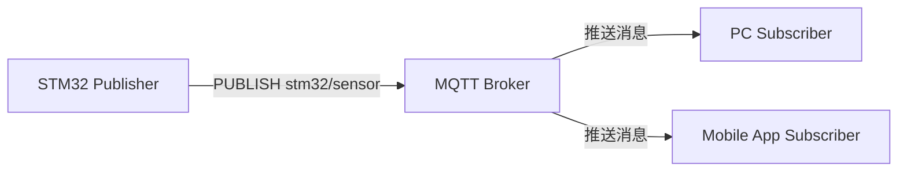
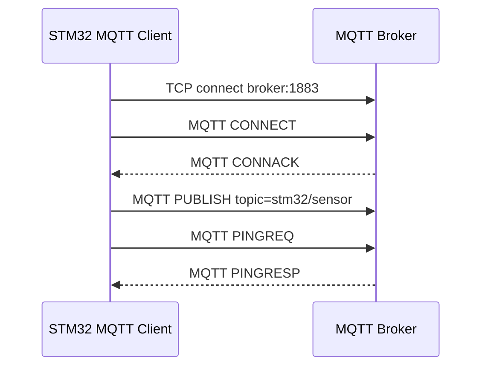
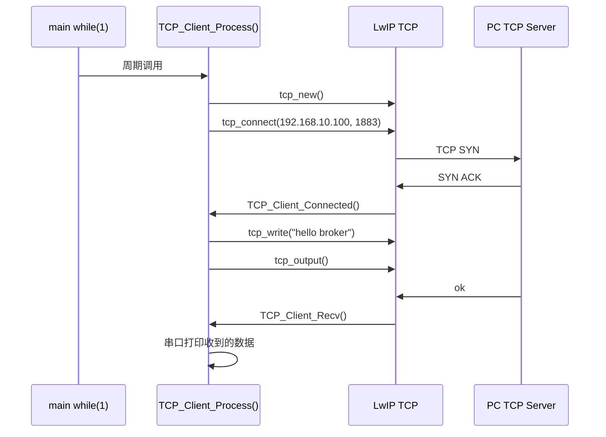
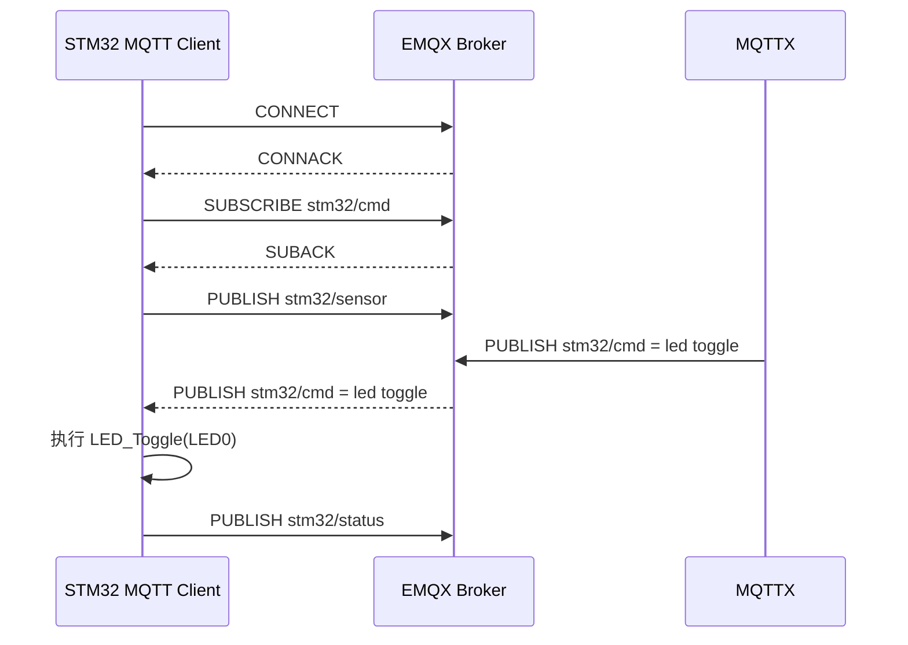
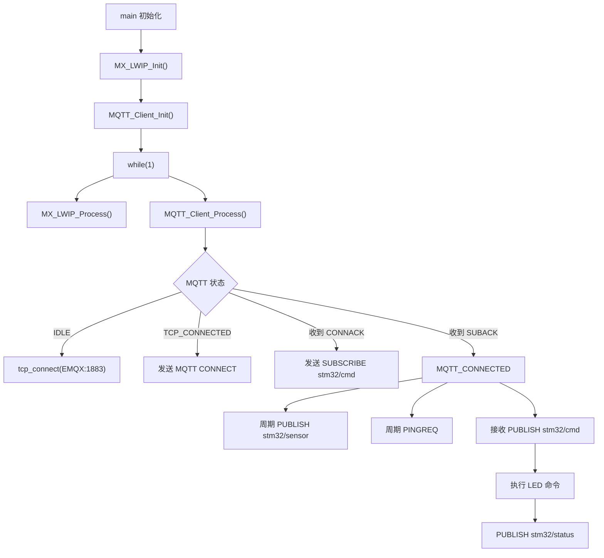

# 阶段 6：MQTT over Ethernet 入门与实测记录

本阶段目标：理解 MQTT 如何运行在 TCP 之上，并让 STM32 通过以太网连接本地 EMQX Broker，完成数据上报和命令下发。

当前实验基础：

| 设备/模块 | 地址或端口 | 说明 |
| --- | --- | --- |
| PC 有线网卡 | `192.168.10.100/24` | 运行 EMQX、MQTTX、测试 TCP Server |
| STM32 ETH | `192.168.10.123/24` | LwIP 裸机模式，`NO_SYS=1` |
| UDP 命令端口 | `5000` | 前一阶段的 UDP echo/命令实验 |
| TCP 命令端口 | `5001` | TCP Server 命令实验 |
| HTTP 页面端口 | `80` | 简单 HTTP Server 实验 |
| MQTT Broker 端口 | `1883` | EMQX 明文 MQTT TCP 端口 |
| EMQX Dashboard | `18083` | 图形化管理页面 |

本阶段先不直接连接公网云平台，而是在 PC 上运行本地 EMQX Broker，把 MQTT 的基本流程完整打通。

## 1. MQTT 是什么

MQTT 是物联网常用的应用层协议。它运行在 TCP 之上，采用发布/订阅模型。

它的特点：

- 运行在 TCP 连接上。
- 面向设备通信，不是网页浏览。
- 使用 `topic` 区分消息主题。
- 设备之间通常不直接互相寻找，而是都连接到同一个 MQTT Broker。
- 发布者只负责向某个 topic 发布消息，订阅者只负责订阅自己关心的 topic。

一句话理解：

```text
MQTT = 设备连接 Broker，通过 topic 发布和订阅消息。
```

## 2. MQTT 和前几天内容的关系

前几天已经学习过：

```text
Ethernet -> ARP -> IPv4 -> ICMP / UDP / TCP -> HTTP
```

MQTT 所在的位置是：

```text
Ethernet
  -> IPv4
    -> TCP
      -> MQTT
```

所以 MQTT 不是替代 TCP，而是像 HTTP 一样，跑在 TCP 连接上的应用层协议。

| 协议 | 底层 | 主要用途 | 通信模型 |
| --- | --- | --- | --- |
| UDP 命令 | UDP | 简单局域网控制 | 一问一答 |
| TCP 命令 | TCP | 自定义可靠命令 | 连接内收发 |
| HTTP | TCP | 浏览器访问页面 | 请求/响应 |
| MQTT | TCP | 设备和云端通信 | 发布/订阅 |

## 3. MQTT 的三个核心角色

### 3.1 Broker

Broker 是 MQTT 服务器，负责消息中转。

Broker 的职责：

- 接收设备连接。
- 维护 topic。
- 接收发布消息。
- 把消息转发给订阅者。

可以把 Broker 理解成“消息中转站”。

常见 Broker：

- EMQX
- Mosquitto
- 阿里云 IoT
- 腾讯云 IoT

### 3.2 Publisher

Publisher 是消息发布者。例如 STM32 发布传感器数据：

```text
topic: stm32/sensor
payload: {"temp":25.3,"humi":60.0,"light":1234}
```

含义：

```text
STM32 把传感器数据发给 Broker。
Broker 再转发给订阅了 stm32/sensor 的客户端。
```

### 3.3 Subscriber

Subscriber 是消息订阅者。例如 PC 或手机 App 订阅：

```text
stm32/sensor
```

只要 STM32 发布这个 topic，PC 或 App 就会收到消息。

## 4. 发布/订阅模型

HTTP 是“客户端请求，服务器响应”：

```text
Browser -> GET /
STM32   -> HTML
```

MQTT 是“大家都连接 Broker，通过 topic 交换消息”：



这意味着：

```text
STM32 不需要知道 PC 或 App 的 IP。
PC/App 也不需要直接连接 STM32。
大家只需要连接同一个 Broker。
```

## 5. MQTT 最小连接流程

一个 MQTT Client 通常这样工作：



关键步骤说明：

| 步骤 | 作用 |
| --- | --- |
| TCP connect | 先建立 TCP 连接 |
| CONNECT | MQTT 登录/建立会话请求 |
| CONNACK | Broker 确认 MQTT 连接成功 |
| PUBLISH | 发布一条业务消息 |
| SUBSCRIBE | 订阅一个命令或数据 topic |
| PINGREQ/PINGRESP | 保活，确认连接仍然在线 |

## 6. MQTT 默认端口

| 端口 | 含义 |
| --- | --- |
| `1883` | MQTT 明文 TCP |
| `8883` | MQTT over TLS |
| `8083` | MQTT over WebSocket，常见于网页客户端 |

当前阶段先使用：

```text
MQTT 明文 TCP，端口 1883
```

暂时不学习 TLS，因为 TLS 对 RAM、Flash、证书管理要求更高。

## 7. 为什么 STM32 要作为 TCP Client

前面 TCP Server 和 HTTP Server 阶段，STM32 的角色是 Server：

```text
PC / 浏览器 -> 主动连接 STM32
STM32       -> 等别人连接
```

Server 流程核心函数：

```c
tcp_new();
tcp_bind();
tcp_listen();
tcp_accept();
tcp_recv();
tcp_write();
```

MQTT 场景通常反过来。MQTT 的服务器是 Broker，STM32 通常作为 Client 主动连接 Broker：

```text
STM32 -> Broker:1883
```

Client 流程核心函数：

```c
tcp_new();
tcp_connect();
tcp_recv();
tcp_write();
tcp_output();
```

这里没有 `tcp_bind()`、`tcp_listen()`、`tcp_accept()`，因为 STM32 不再等待别人连接，而是主动连接别人。

## 8. TCP Server 和 TCP Client 对比

| 项目 | TCP Server | TCP Client |
| --- | --- | --- |
| 谁主动连接 | 对方主动连接 STM32 | STM32 主动连接对方 |
| 典型场景 | HTTP Server、TCP 命令服务 | MQTT Client、访问云端 |
| 关键函数 | `tcp_bind()`、`tcp_listen()`、`tcp_accept()` | `tcp_connect()` |
| 本地端口 | 固定监听端口，例如 `80`、`5001` | 通常由 LwIP 自动分配临时端口 |
| 远端地址 | 不确定，等待客户端进入 | 明确知道 Broker IP 和端口 |

记忆方式：

```text
accept  = 别人来，我接入。
connect = 我主动出去连接别人。
```

## 9. 为什么 Broker 不主动连接 STM32

实际物联网场景中，设备经常在局域网、路由器、防火墙后面。例如 STM32 地址：

```text
192.168.10.123
```

这个地址只在当前局域网内有效，云端 Broker 通常无法主动连接它。

但是 STM32 可以主动连接外部服务器：

```text
STM32 -> 云端 Broker
```

这也是物联网常见模式：

```text
设备主动连接云端。
云端通过已经建立好的连接下发消息。
```

## 10. TCP Client 验证实验

在写 MQTT 报文之前，先做一个最小 TCP Client 实验。

实验目标：

```text
PC 作为 TCP Server，监听 1883。
STM32 作为 TCP Client，主动连接 192.168.10.100:1883。
STM32 连接成功后发送 hello broker。
PC 回复 ok。
STM32 串口打印收到的 ok。
```

验证能力：

```text
STM32 主动连接能力
tcp_connect()
connected 回调
recv 回调
tcp_write()
tcp_output()
```

这个实验打通后，后面只需要把：

```text
hello broker
```

替换成：

```text
MQTT CONNECT 报文
```

就可以进入真正的 MQTT CONNECT 阶段。

### TCP Client 调用逻辑



裸机 `NO_SYS=1` 下，`tcp_connect()` 不会自己在后台运行，仍然依赖主循环持续调用：

```c
MX_LWIP_Process();
```

### TCP Client 实测记录

```text
PC      = TCP Server，监听 192.168.10.100:1883
STM32   = TCP Client，主动连接 192.168.10.100:1883
```

STM32 串口成功日志：

```text
[TCP-CLIENT] test client ready
[ETH] link up: 10M half duplex
[TCP-CLIENT] connect to 192.168.10.100:1883
[TCP-CLIENT] connected
[TCP-CLIENT] tx: hello broker
[TCP-CLIENT] rx: ok
```

逐条说明：

| 日志 | 含义 |
| --- | --- |
| `[TCP-CLIENT] test client ready` | TCP Client 验证模块已经初始化 |
| `[TCP-CLIENT] connect to 192.168.10.100:1883` | STM32 开始主动连接 PC 端 TCP Server |
| `[TCP-CLIENT] connected` | TCP 三次握手完成，连接建立成功 |
| `[TCP-CLIENT] tx: hello broker` | STM32 通过 TCP 连接发送测试文本 |
| `[TCP-CLIENT] rx: ok` | STM32 收到 PC Server 回复的 `ok` |

这个实验证明：

```text
STM32 已经具备主动 TCP 连接能力。
STM32 可以向 PC Server 发送数据。
STM32 可以接收 PC Server 返回的数据。
```

这正是后续 MQTT Client 的基础。

## 11. 为什么 PC 需要放行 TCP 1883 入站

前几天多数实验是：

```text
PC 主动访问 STM32
```

例如：

```text
浏览器 -> STM32:80
PowerShell -> STM32:5000
TCP 客户端 -> STM32:5001
```

这时 PC 是客户端，主动向外连接，通常不会被 Windows 防火墙拦截。

TCP Client 实验变成：

```text
STM32 主动访问 PC
STM32 -> PC:1883
```

这时 PC 是 Server，需要接收来自外部设备的入站 TCP 连接。Windows 防火墙默认可能拦截入站连接，所以需要放行 `1883` 端口。

管理员 PowerShell 执行：

```powershell
New-NetFirewallRule -DisplayName "Allow TCP 1883 Test" -Direction Inbound -Protocol TCP -LocalPort 1883 -Action Allow
```

命令含义：

| 参数 | 含义 |
| --- | --- |
| `New-NetFirewallRule` | 新增一条 Windows 防火墙规则 |
| `-DisplayName "Allow TCP 1883 Test"` | 规则名称，方便以后识别 |
| `-Direction Inbound` | 允许入站连接，也就是外部设备连接本机 |
| `-Protocol TCP` | 规则作用于 TCP 协议 |
| `-LocalPort 1883` | 只放行本机 `1883` 端口 |
| `-Action Allow` | 动作为允许 |

放行前可能出现：

```text
STM32 -> PC:1883 SYN
Windows 防火墙拦截
STM32 等不到正常响应
LwIP 返回 err=-13
```

放行后变成：

```text
STM32 -> PC:1883 SYN
PC -> STM32 SYN ACK
STM32 -> PC ACK
TCP connected
```

记忆方式：

```text
PC 访问 STM32：PC 是客户端，一般不需要开入站端口。
STM32 访问 PC：PC 是服务器，需要允许对应入站端口。
```

后续如果 PC 上运行 MQTT Broker，例如 EMQX 或 Mosquitto 监听 `1883`，也需要确保 Windows 防火墙允许入站 `1883`，否则 STM32 无法连接 Broker。

## 12. EMQX Broker 启动记录

本次使用 Docker Desktop 运行 EMQX。

启动 EMQX：

```powershell
docker run -d --name emqx `
  -p 1883:1883 `
  -p 18083:18083 `
  emqx/emqx:latest
```

查看容器：

```powershell
docker ps
```

成功结果中应看到：

```text
0.0.0.0:1883->1883/tcp
0.0.0.0:18083->18083/tcp
```

端口含义：

| 端口 | 作用 |
| --- | --- |
| `1883` | MQTT 明文 TCP 端口，STM32 后续连接这里 |
| `18083` | EMQX Dashboard 图形化管理界面 |

Dashboard 地址：

```text
http://localhost:18083
```

如果 Dashboard 能打开并显示集群概览，说明 EMQX Broker 已经启动成功。

## 13. MQTT CONNECT 报文

STM32 连接 EMQX 时，先建立 TCP 连接：

```text
STM32 -> 192.168.10.100:1883
```

然后发送 MQTT CONNECT 报文。本实验使用 MQTT 3.1.1，Client ID：

```text
stm32-f407-eth
```

CONNECT 报文内容：

```text
10 1A
00 04 4D 51 54 54
04
02
00 3C
00 0E 73 74 6D 33 32 2D 66 34 30 37 2D 65 74 68
```

逐段说明：

| 字节 | 含义 |
| --- | --- |
| `10` | MQTT 固定报头，表示 CONNECT |
| `1A` | 剩余长度，十进制 26 |
| `00 04 4D 51 54 54` | 协议名 `MQTT` |
| `04` | 协议级别，表示 MQTT 3.1.1 |
| `02` | Connect Flags，Clean Session = 1 |
| `00 3C` | Keep Alive = 60 秒 |
| `00 0E` | Client ID 长度 = 14 |
| `73 ... 68` | Client ID 字符串 `stm32-f407-eth` |

如果 EMQX 接受连接，会返回 CONNACK：

```text
20 02 00 00
```

含义：

| 字节 | 含义 |
| --- | --- |
| `20` | MQTT 固定报头，表示 CONNACK |
| `02` | 剩余长度为 2 |
| `00` | Session Present = 0 |
| `00` | Return Code = 0，连接成功 |

验证标准：

```text
[MQTT] tcp connected
[MQTT] tx CONNECT
[MQTT] rx CONNACK accepted
```

## 14. MQTT CONNECT 实测记录

STM32 串口日志：

```text
[MQTT] client ready
[MQTT] tcp connect to 192.168.10.100:1883
[MQTT] tcp connected
[MQTT] tx CONNECT: 10 1A 00 04 4D 51 54 54 04 02 00 3C 00 0E 73 74 6D 33 32 2D 66 34 30 37 2D 65 74 68
[MQTT] rx: 20 02 00 00
[MQTT] rx CONNACK accepted
```

EMQX Dashboard 客户端页面可以看到：

```text
客户端 ID: stm32-f407-eth
状态: 已连接
心跳: 60
Clean Start / 清除会话: true
```

这说明：

```text
STM32 TCP 连接 EMQX 成功。
STM32 发送的 MQTT CONNECT 报文格式正确。
EMQX 返回 CONNACK 20 02 00 00。
MQTT 层连接成功。
```

### 为什么会出现 broker closed

串口后面可能出现：

```text
[MQTT] broker closed
```

这是因为 CONNECT 报文里设置了：

```text
Keep Alive = 60 秒
```

MQTT 规定客户端需要在 Keep Alive 时间内持续和 Broker 保持通信。如果没有业务数据，就应该周期性发送 PINGREQ。否则 Broker 会认为客户端掉线并主动断开连接。

## 15. MQTT PINGREQ/PINGRESP 保活

本次程序增加了保活：

```text
每 30 秒发送一次 PINGREQ
```

PINGREQ 报文：

```text
C0 00
```

Broker 正常回复 PINGRESP：

```text
D0 00
```

STM32 串口预期：

```text
[MQTT] rx CONNACK accepted
[MQTT] tx PINGREQ: C0 00
[MQTT] rx: D0 00
[MQTT] rx PINGRESP
```

选择 30 秒，是因为 Keep Alive 是 60 秒。客户端在超时前主动发保活，可以让 Broker 确认 STM32 仍然在线。

## 16. MQTT PUBLISH 发送传感器数据

当 MQTT 连接和保活稳定后，开始发布业务数据。

早期固定数据：

```text
topic: stm32/sensor
payload: {"temp":25.3,"humi":60.0,"light":1234}
```

串口预期：

```text
[MQTT] tx PUBLISH topic=stm32/sensor payload={"temp":25.3,"humi":60.0,"light":1234}
```

这说明 STM32 已经可以通过 MQTT 向 Broker 发布业务消息。

### PUBLISH 报文结构

本阶段实现的是 MQTT 3.1.1 的最小 QoS0 PUBLISH：

```text
30 xx
00 0C 73 74 6D 33 32 2F 73 65 6E 73 6F 72
payload bytes...
```

说明：

| 字段 | 含义 |
| --- | --- |
| `30` | PUBLISH 固定报头，QoS 0，不保留 |
| `xx` | 剩余长度 |
| `00 0C` | topic 长度 12 |
| `stm32/sensor` | topic 名称 |
| 后面内容 | JSON payload |

## 17. MQTTX 订阅验证

在 MQTTX 中连接本地 EMQX Broker：

```text
Host: 192.168.10.100
Port: 1883
Protocol: mqtt://
```

订阅主题：

```text
stm32/sensor
```

MQTTX 成功收到 STM32 发布的数据：

```json
{
  "temp": 25.3,
  "humi": 60,
  "light": 1234
}
```

链路闭环：

```text
STM32 -> EMQX Broker -> MQTTX 订阅端
```

这意味着：

- STM32 连接 Broker 成功。
- MQTT Keep Alive 正常。
- STM32 PUBLISH 成功。
- MQTTX 订阅成功。
- Broker 转发成功。

## 18. MQTT SUBSCRIBE 控制 LED

后续程序在 MQTT CONNECT 成功后，新增订阅命令主题：

```text
stm32/cmd
```

流程变成：



STM32 串口侧成功订阅时应看到：

```text
[MQTT] tx SUBSCRIBE topic=stm32/cmd: 82 0E 00 01 00 09 73 74 6D 33 32 2F 63 6D 64 00
[MQTT] rx: 90 03 00 01 00
[MQTT] rx SUBACK accepted topic=stm32/cmd
```

SUBSCRIBE 报文说明：

| 字节 | 含义 |
| --- | --- |
| `82` | SUBSCRIBE 固定报头 |
| `0E` | Remaining Length = 14 |
| `00 01` | Packet Identifier = 1 |
| `00 09` | topic 长度 9 |
| `73 74 6D 33 32 2F 63 6D 64` | topic 字符串 `stm32/cmd` |
| `00` | 请求 QoS 0 |

注意：这里 Remaining Length 是 `0x0E`，不是 `0x0F`。长度算错时 Broker 不会正确解析订阅请求。

## 19. MQTTX 下发 LED 控制命令

在 MQTTX 中发布命令：

| 项目 | 配置 |
| --- | --- |
| Topic | `stm32/cmd` |
| Payload | `led on` / `led off` / `led toggle` |
| QoS | `0` |
| Retain | 关闭 |

STM32 收到命令后会执行 LED 动作，并打印：

```text
[MQTT] rx PUBLISH topic=stm32/cmd payload=led on
[MQTT] cmd led on -> LED0 on

[MQTT] rx PUBLISH topic=stm32/cmd payload=led off
[MQTT] cmd led off -> LED0 off

[MQTT] rx PUBLISH topic=stm32/cmd payload=led toggle
[MQTT] cmd led toggle -> LED0 toggle
```

这一步说明 MQTT 已经从“只上报数据”升级为“双向通信”：

```text
STM32 发布传感器数据 -> PC/MQTTX 查看
PC/MQTTX 发布控制命令 -> STM32 执行动作
```

## 20. 状态回传 topic：stm32/status

为了让 PC 端立刻知道命令执行结果，程序新增状态回传 topic：

```text
stm32/status
```

当收到 `led toggle` 后，STM32 会立即发布：

```json
{"led0":1,"led1":0,"cmd":"led toggle"}
```

MQTTX 可以同时订阅：

```text
stm32/sensor
stm32/status
```

这样可以看到两类消息：

| Topic | 方向 | 含义 |
| --- | --- | --- |
| `stm32/sensor` | STM32 -> EMQX -> MQTTX | 周期上报传感器数据和 LED 状态 |
| `stm32/cmd` | MQTTX -> EMQX -> STM32 | 下发 LED 控制命令 |
| `stm32/status` | STM32 -> EMQX -> MQTTX | 命令执行后的即时状态回传 |

## 21. 最终实测串口记录

本次最终程序启动后，串口看到：

```text
[ETH] PHY reset released
[PHY] scan start
[PHY] found addr=0 PHYID=0x0007C0F1
[ETH] LwIP init
[ETH] IP=192.168.10.123 NETMASK=255.255.255.0 GW=192.168.10.1
[UDP] echo server listen on port 5000
[TCP] command server listen on port 5001
[HTTP] server listen on port 80
[MQTT] client ready

[ETH] link up: 10M half duplex
[ETH] ready: ping 192.168.10.123, UDP echo port 5000
[MQTT] tcp connect to 192.168.10.100:1883
[MQTT] tcp connected
[MQTT] tx CONNECT: 10 1A 00 04 4D 51 54 54 04 02 00 3C 00 0E 73 74 6D 33 32 2D 66 34 30 37 2D 65 74 68
[MQTT] rx: 20 02 00 00
[MQTT] rx CONNACK accepted
[MQTT] tx SUBSCRIBE topic=stm32/cmd: 82 0E 00 01 00 09 73 74 6D 33 32 2F 63 6D 64 00
[MQTT] rx: 90 03 00 01 00
[MQTT] rx SUBACK accepted topic=stm32/cmd
```

周期上报真实数据：

```text
[MQTT] tx PUBLISH topic=stm32/sensor payload={"temp":26.0,"humi":55.0,"light_adc":3785,"light_v":3.050,"led0":0,"led1":0}
[MQTT] tx PUBLISH topic=stm32/sensor payload={"temp":26.0,"humi":59.0,"light_adc":3800,"light_v":3.062,"led0":1,"led1":0}
```

保活正常：

```text
[MQTT] tx PINGREQ: C0 00
[MQTT] rx: D0 00
[MQTT] rx PINGRESP
```

MQTTX 下发命令后，STM32 收到并执行：

```text
[MQTT] rx PUBLISH topic=stm32/cmd payload=led toggle
[MQTT] cmd led toggle -> LED0 toggle
[MQTT] tx PUBLISH topic=stm32/status payload={"led0":1,"led1":0,"cmd":"led toggle"}
```

## 22. 最终程序调用逻辑



## 23. 本阶段掌握点

完成本阶段后，需要能讲清楚：

- MQTT 跑在 TCP 之上。
- STM32 做 MQTT 时通常是 Client。
- Broker 是消息中转站，不是传感器数据的最终显示界面。
- `CONNECT -> CONNACK` 表示 MQTT 层连接成功。
- `PINGREQ -> PINGRESP` 用来维持连接不被 Broker 断开。
- `PUBLISH stm32/sensor` 是 STM32 上报数据。
- `SUBSCRIBE stm32/cmd` 是 STM32 等待 PC/MQTTX 下发命令。
- `PUBLISH stm32/status` 是 STM32 把命令执行结果回传给 PC/MQTTX。

## 24. 本阶段最终结论

这一阶段已经完成从“STM32 能连接 Broker”到“STM32 能和 PC/MQTTX 双向通信”的闭环：

```text
传感器数据上报：STM32 -> EMQX -> MQTTX
LED 控制命令：  MQTTX -> EMQX -> STM32
执行状态回传：  STM32 -> EMQX -> MQTTX
```

下一阶段可以继续做：

- 把 MQTT 上报数据接入真实业务页面。
- 增加更多命令，例如控制 LED1、蜂鸣器、上报间隔。
- 研究 MQTT 断线重连。
- 研究 QoS1、用户名密码认证、云平台接入。
