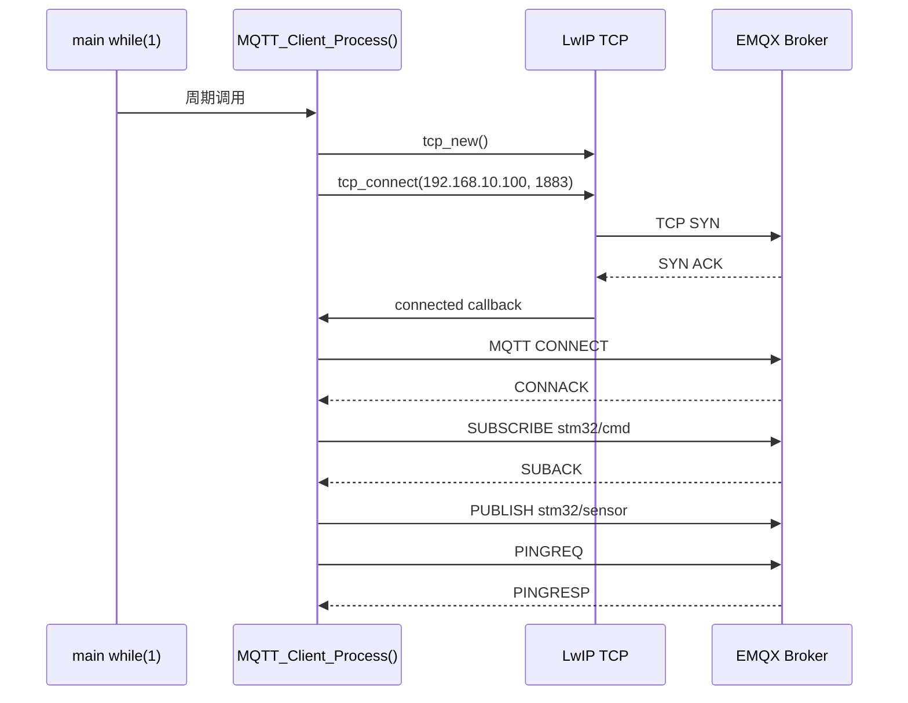
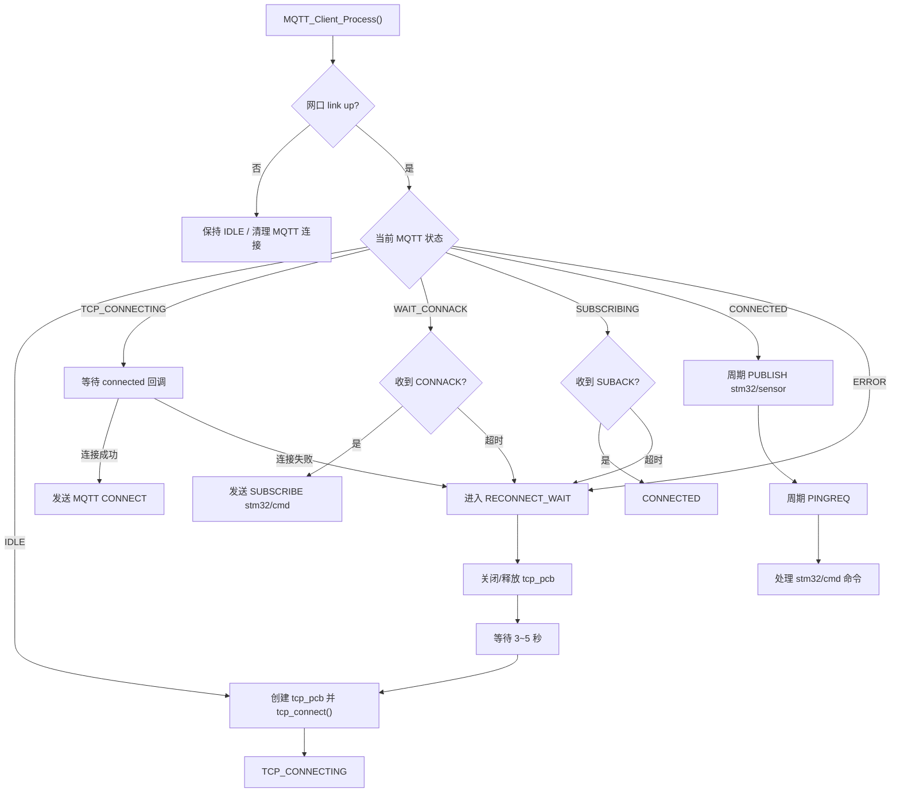
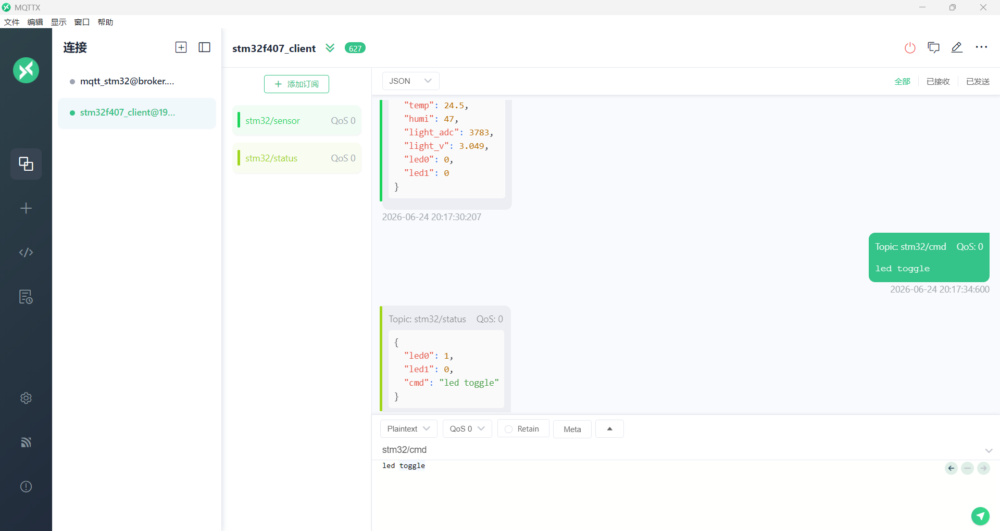
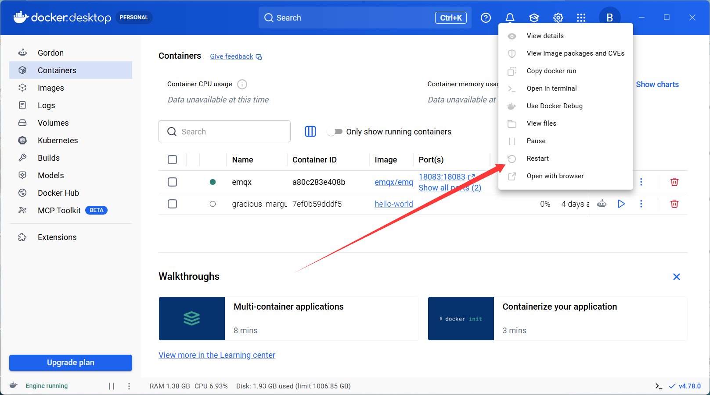

# 阶段 7：MQTT 断线重连与状态机工程化

第六天已经完成了 MQTT 的基本闭环：

```text
STM32 -> EMQX -> MQTTX：上报 stm32/sensor
MQTTX -> EMQX -> STM32：下发 stm32/cmd
STM32 -> EMQX -> MQTTX：回传 stm32/status
```

这说明 STM32 已经可以作为 MQTT Client 使用。第七天要解决的是另一个更工程化的问题：

```text
如果网络断开、EMQX 重启、Broker 主动关闭连接，STM32 能不能自己恢复？
```

本阶段目标不是新增更多业务功能，而是把“能跑通”的 MQTT Client，整理成“能长期运行、能自动恢复”的 MQTT Client。

## 1. 为什么要学习断线重连

实验室里第一次连接成功，并不代表真实设备就稳定了。真实运行时会遇到很多变化：

- EMQX Broker 被重启。
- Docker Desktop 被关闭或重启。
- 网线被拔掉又插回。
- PC 网卡短暂断开。
- Broker 因 Keep Alive 超时主动断开连接。
- TCP 连接失败。
- MQTT CONNECT 发出后没有收到 CONNACK。
- SUBSCRIBE 发出后没有收到 SUBACK。

如果程序只在上电时连接一次，那么一旦失败，就可能永远停在错误状态。物联网设备通常需要自己恢复连接，因为设备部署后不一定有人手动复位。

第七天要学习的核心就是：

```text
失败不可怕，关键是程序要知道自己失败了，并且能回到正确的状态重新开始。
```

## 2. 第六天程序的局限

第六天的 MQTT 程序已经具备这些能力：

- TCP 连接 EMQX。
- 发送 MQTT CONNECT。
- 接收 CONNACK。
- 订阅 `stm32/cmd`。
- 接收 SUBACK。
- 周期发布 `stm32/sensor`。
- 周期发送 PINGREQ。
- 接收 PINGRESP。
- 接收 `stm32/cmd` 并控制 LED。
- 发布 `stm32/status`。

但是它还需要继续增强：

| 问题 | 现象 | 第七天要做的方向 |
| --- | --- | --- |
| Broker 关闭连接 | 串口打印 `[MQTT] broker closed` | 进入重连等待状态 |
| TCP 连接失败 | `tcp_connect` 返回错误或回调错误 | 清理旧连接，延时重试 |
| 没收到 CONNACK | TCP 已连上，但 MQTT 没成功 | 超时后重新连接 |
| 没收到 SUBACK | CONNECT 成功，但订阅失败 | 超时后重新订阅或重连 |
| 网线断开 | `[ETH] link down` | 停止 MQTT 发送，等待 link up 后重连 |
| Broker 重启 | 旧 TCP 连接失效 | 检测关闭后重新走完整流程 |

这一步不是为了“让代码更复杂”，而是让每种异常都有明确去处。

## 3. MQTT 状态机是什么

状态机就是把程序当前处于哪个阶段明确写出来。

例如，不要只用一个变量表示“是否连接”，而是拆成多个清晰状态：

```text
还没开始
正在连 TCP
TCP 已连接
正在等 CONNACK
正在订阅命令 topic
MQTT 已经可用
出错后等待重连
```

这样做的好处是：

- 串口日志更容易看懂。
- 每个状态只做自己该做的事。
- 出错后知道应该退回哪里。
- 后面加断线重连不会乱。
- 后面加用户名密码、QoS、云平台认证时更好扩展。

## 4. 建议的状态定义

第七天建议把 MQTT Client 状态整理成下面这些：

| 状态 | 含义 | 主要动作 |
| --- | --- | --- |
| `MQTT_STATE_IDLE` | 空闲，还没开始连接 | 等待网络 link up 和启动延时 |
| `MQTT_STATE_TCP_CONNECTING` | 正在建立 TCP 连接 | 等待 `tcp_connect()` 回调 |
| `MQTT_STATE_TCP_CONNECTED` | TCP 已连接 | 发送 MQTT CONNECT |
| `MQTT_STATE_WAIT_CONNACK` | 等待 Broker 返回 CONNACK | 收到 `20 02 00 00` 后进入订阅 |
| `MQTT_STATE_SUBSCRIBING` | 已发送 SUBSCRIBE，等待 SUBACK | 收到 `90 03 00 01 00` 后进入可用状态 |
| `MQTT_STATE_CONNECTED` | MQTT 已可用 | 周期 PUBLISH、PINGREQ、接收命令 |
| `MQTT_STATE_RECONNECT_WAIT` | 出错后等待重连 | 等待几秒后重新连接 |
| `MQTT_STATE_ERROR` | 临时错误状态 | 记录错误并转入重连等待 |

状态不需要一开始就设计得非常复杂，但必须有两个关键点：

```text
正常路径：IDLE -> TCP -> CONNECT -> SUBSCRIBE -> CONNECTED
异常路径：任何失败 -> 清理连接 -> RECONNECT_WAIT -> IDLE
```

## 5. MQTT 正常连接流程

正常情况下，调用逻辑如下：



这条路径走通后，说明 MQTT Client 进入可用状态。

## 6. MQTT 状态机调用逻辑图

第七天的核心图如下：



这个图要重点理解：

- `MQTT_Client_Process()` 不只是负责发送数据，它负责推进整个 MQTT 状态机。
- 连接失败后不要立刻无限重试，否则串口刷屏，也可能让网络栈压力变大。
- 每次重连都要重新走 TCP connect、MQTT CONNECT、SUBSCRIBE。
- 重连成功后，业务上报和命令接收才能恢复。

## 7. 重连策略

推荐采用简单稳定的策略：

```text
失败 -> 清理连接 -> 等待 3 秒 -> 重新连接
```

不要一失败就立刻重连。原因是：

- EMQX 可能还没有启动完成。
- 网卡 link up 后，网络栈可能还需要一点时间稳定。
- PC 防火墙、Docker、网卡状态可能需要短暂恢复。
- 立即快速重试会让串口日志很乱，也可能让 LwIP 分配资源更频繁。

建议参数：

| 参数 | 建议值 | 含义 |
| --- | --- | --- |
| 重连等待时间 | `3000 ms` 或 `5000 ms` | 出错后多久再试 |
| MQTT CONNECT 超时 | `5000 ms` | TCP 已连接后等 CONNACK 的最长时间 |
| SUBACK 超时 | `5000 ms` | 发送 SUBSCRIBE 后等 SUBACK 的最长时间 |
| PUBLISH 周期 | `10000 ms` | 每 10 秒上报一次传感器 |
| PINGREQ 周期 | `30000 ms` | Keep Alive 为 60 秒时，每 30 秒保活 |

## 8. 什么时候进入重连

下面这些情况都应该进入重连等待：

| 情况 | 判断方式 | 处理 |
| --- | --- | --- |
| Broker 主动关闭 | `p == NULL` | 打印 `broker closed`，关闭 pcb，等待重连 |
| TCP 错误回调 | `tcp_err()` | 设置 pcb 为 NULL，进入重连等待 |
| `tcp_connect()` 失败 | 返回值不是 `ERR_OK` | 关闭 pcb，等待重连 |
| CONNECT 超时 | 超过指定时间没收到 CONNACK | 关闭 pcb，等待重连 |
| SUBSCRIBE 超时 | 超过指定时间没收到 SUBACK | 关闭 pcb，等待重连 |
| PUBLISH/PINGREQ 写失败 | `tcp_write()` 失败 | 关闭 pcb，等待重连 |
| 网线断开 | `netif_is_link_up()` 为 false | 停止发送，关闭连接 |

重点：不要只打印错误，要把状态切走。

## 9. 为什么重连后要重新 SUBSCRIBE

MQTT 连接断开后，之前的 TCP 连接已经不存在了。

即使新的 TCP 连接重新建立成功，Broker 也不一定保留之前的订阅关系。第六天我们使用的是 Clean Session：

```text
Connect Flags = 0x02
Clean Session = 1
```

这表示每次连接都是一个新的干净会话。因此重连后必须重新订阅：

```text
CONNECT -> CONNACK -> SUBSCRIBE stm32/cmd -> SUBACK
```

如果不重新订阅，现象会是：

```text
STM32 可以继续发布 stm32/sensor
但是 MQTTX 下发 stm32/cmd，STM32 收不到
```

## 10. 第七天实验计划

### 实验 1：正常启动连接

目标：确认重构后的状态机不破坏第六天功能。

步骤：

1. 启动 EMQX。
2. 复位 STM32。
3. 打开串口助手。
4. MQTTX 订阅 `stm32/sensor` 和 `stm32/status`。

预期串口：

```text
[MQTT] tcp connect to 192.168.10.100:1883
[MQTT] tcp connected
[MQTT] tx CONNECT
[MQTT] rx CONNACK accepted
[MQTT] tx SUBSCRIBE topic=stm32/cmd
[MQTT] rx SUBACK accepted topic=stm32/cmd
```

### 实验 2：重启 EMQX

目标：验证 Broker 重启后 STM32 能自动恢复。

操作：

```powershell
docker restart emqx
```

预期现象：

```text
[MQTT] broker closed
[MQTT] reconnect wait
[MQTT] tcp connect to 192.168.10.100:1883
[MQTT] tcp connected
[MQTT] rx CONNACK accepted
[MQTT] rx SUBACK accepted topic=stm32/cmd
```

验证：

- MQTTX 重新看到 `stm32/sensor`。
- MQTTX 下发 `led toggle` 后，STM32 仍能执行。
- STM32 仍能发布 `stm32/status`。

### 实验 3：停止 EMQX 再启动

目标：验证 Broker 长时间不可用时，STM32 不会卡死。

操作：

```powershell
docker stop emqx
```

等待 20 秒后：

```powershell
docker start emqx
```

预期：

- EMQX 停止期间，STM32 周期性进入重连等待。
- EMQX 恢复后，STM32 自动连接成功。
- 串口不会疯狂刷屏。

### 实验 4：拔插网线

目标：验证 link down/link up 后 MQTT 能恢复。

操作：

1. 拔掉 STM32 网线。
2. 等待串口出现 `link down`。
3. 插回网线。
4. 等待 `link up`。

预期：

```text
[ETH] link down
[MQTT] link down, close connection
[ETH] link up: 10M half duplex
[MQTT] reconnect wait
[MQTT] tcp connect to 192.168.10.100:1883
```

验证：

- MQTTX 重新收到传感器数据。
- MQTTX 下发命令仍能控制 LED。

## 11. 程序修改方向

第七天修改程序时，建议按这个顺序做：

1. 增加更明确的 MQTT 状态枚举。
2. 增加重连等待时间变量。
3. 增加进入重连状态的统一函数。
4. 修改 `broker closed`、`tcp_err()`、`tcp_write()` 失败后的处理。
5. 增加 CONNACK/SUBACK 超时判断。
6. 检查 link down 时关闭 MQTT 连接。
7. 保留第六天已经跑通的 PUBLISH、SUBSCRIBE、PINGREQ 功能。

建议先不要同时改 JSON 命令协议。第七天只解决稳定性，业务协议放到后面再升级。

## 12. 建议的核心函数职责

| 函数 | 职责 |
| --- | --- |
| `MQTT_Client_Init()` | 初始化 MQTT 状态机和计时变量 |
| `MQTT_Client_Process()` | 在主循环中推进状态机 |
| `MQTT_Client_StartConnect()` | 创建 pcb 并发起 TCP 连接 |
| `MQTT_Client_Connected()` | TCP 连接成功回调，发送 CONNECT |
| `MQTT_Client_Recv()` | 处理 CONNACK、SUBACK、PINGRESP、PUBLISH |
| `MQTT_Client_Error()` | TCP 错误回调，进入重连 |
| `MQTT_Client_Close()` | 关闭并清理当前 TCP pcb |
| `MQTT_Client_EnterReconnect()` | 统一进入重连等待状态 |
| `MQTT_Client_SendPublish()` | 周期上报 `stm32/sensor` |
| `MQTT_Client_SendPingReq()` | 周期发送 PINGREQ |
| `MQTT_Client_HandlePublish()` | 解析下行 PUBLISH |
| `MQTT_Client_HandleCommand()` | 执行 `stm32/cmd` 命令 |

## 13. 第七天重点理解

本阶段最重要的不是多写多少代码，而是理解三个原则：

### 原则 1：每个状态只做一件事

例如 `MQTT_STATE_CONNECTED` 才允许：

- 发 PUBLISH。
- 发 PINGREQ。
- 处理下行命令。

如果还没收到 SUBACK，就不要假装命令通道已经可用。

### 原则 2：失败后要清理现场

TCP 连接失败后，旧的 `tcp_pcb` 可能已经不能继续使用。

因此错误路径通常要做：

```text
停止回调 -> close/abort pcb -> pcb = NULL -> 进入 RECONNECT_WAIT
```

### 原则 3：重连要重新走完整 MQTT 流程

不要只重新 TCP connect 后就直接 PUBLISH。

正确流程：

```text
TCP connect
MQTT CONNECT
等待 CONNACK
SUBSCRIBE stm32/cmd
等待 SUBACK
进入 MQTT_CONNECTED
恢复 PUBLISH / PINGREQ / 命令接收
```

## 14. 第七天学习完成标准

如果下面几项都能做到，就说明第七天学习完成：

- 能画出 MQTT 状态机流程图。
- 能解释为什么重连后要重新 SUBSCRIBE。
- 能解释 `broker closed` 后程序应该做什么。
- 能解释为什么不能失败后立刻疯狂重连。
- 能通过 `docker restart emqx` 验证 STM32 自动恢复。
- 能通过 MQTTX 验证恢复后仍能收到 `stm32/sensor`。
- 能通过 MQTTX 验证恢复后仍能下发 `stm32/cmd` 控制 LED。

## 15. 本阶段最终结论

第六天解决的是：

```text
MQTT 能不能跑通？
```

第七天解决的是：

```text
MQTT 断了以后能不能自己恢复？
```

物联网设备最终要追求的不是“连上一次”，而是“长期运行中不断线，断了也能回来”。

本阶段程序修改已经围绕这句话完成：

```text
把 MQTT Client 从一次性连接，升级为可自动重连的状态机。
```

## 16. 实验 1：正常上电连接与发布订阅验证

实验时间：2026-06-24 20:17 左右。

实验目的：验证 STM32 正常上电后，能否自动连接 EMQX Broker，并完成 MQTT 发布、订阅、下行控制和状态回传。

### 16.1 MQTTX 侧验证截图



截图中可以看到：

- MQTTX 已连接到本地 Broker。
- MQTTX 订阅了 `stm32/sensor` 和 `stm32/status`。
- STM32 发布了 `stm32/sensor` 数据。
- MQTTX 向 `stm32/cmd` 发送了 `led toggle`。
- STM32 回传了 `stm32/status`，其中 `led0=1`，说明命令已经执行。

### 16.2 STM32 串口关键日志

上电后，基础网络初始化正常：

```text
[ETH] PHY reset start
[ETH] PHY reset released
[PHY] scan start
[PHY] found addr=0 PHYID=0x0007C0F1
[ETH] LwIP init
[ETH] IP=192.168.10.123 NETMASK=255.255.255.0 GW=192.168.10.1
[UDP] echo server listen on port 5000
[TCP] command server listen on port 5001
[HTTP] server listen on port 80
[MQTT] client ready
```

网口 link up 后，MQTT 状态机开始连接 Broker：

```text
[ETH] link up: 10M half duplex
[ETH] ready: ping 192.168.10.123, UDP echo port 5000
[MQTT] link up, reconnect allowed
[MQTT] tcp connect to 192.168.10.100:1883
[MQTT] tcp connected
[MQTT] tx CONNECT: 10 1A 00 04 4D 51 54 54 04 02 00 3C 00 0E 73 74 6D 33 32 2D 66 34 30 37 2D 65 74 68
```

Broker 返回 CONNACK，说明 MQTT 登录成功：

```text
[MQTT] rx: 20 02 00 00
[MQTT] rx CONNACK accepted
```

随后 STM32 订阅 `stm32/cmd`，并收到 SUBACK：

```text
[MQTT] tx SUBSCRIBE topic=stm32/cmd: 82 0E 00 01 00 09 73 74 6D 33 32 2F 63 6D 64 00
[MQTT] rx: 90 03 00 01 00
[MQTT] rx SUBACK accepted topic=stm32/cmd
```

STM32 周期发布传感器数据到 `stm32/sensor`：

```text
[MQTT] tx PUBLISH topic=stm32/sensor payload={"temp":24.5,"humi":47.0,"light_adc":3783,"light_v":3.049,"led0":0,"led1":0}
```

MQTTX 下发 `led toggle` 后，STM32 收到下行 PUBLISH，执行 LED0 翻转，并回传状态：

```text
[MQTT] rx PUBLISH topic=stm32/cmd payload=led toggle
[MQTT] cmd led toggle -> LED0 toggle
[MQTT] tx PUBLISH topic=stm32/status payload={"led0":1,"led1":0,"cmd":"led toggle"}
```

随后新的传感器上报中，`led0` 已经变为 1：

```text
[MQTT] tx PUBLISH topic=stm32/sensor payload={"temp":24.6,"humi":46.0,"light_adc":3783,"light_v":3.049,"led0":1,"led1":0}
```

心跳也正常：

```text
[MQTT] tx PINGREQ: C0 00
[MQTT] rx: D0 00
[MQTT] rx PINGRESP
```

### 16.3 实验结论

实验 1 验证通过。

本次实验证明：

- STM32 上电后能正常初始化 LwIP 和以太网 PHY。
- 网口 link up 后，MQTT 状态机能自动连接 `192.168.10.100:1883`。
- Broker 能返回 CONNACK，说明 MQTT CONNECT 成功。
- STM32 能订阅 `stm32/cmd`，并收到 SUBACK。
- STM32 能周期发布 `stm32/sensor`。
- MQTTX 能下发 `led toggle` 到 `stm32/cmd`。
- STM32 能执行 LED0 翻转，并发布 `stm32/status`。
- MQTT 心跳 `PINGREQ/PINGRESP` 正常，说明连接保持稳定。

实验 1 覆盖的是“正常上电、正常连接、正常发布订阅”的基础稳定性。后续实验可以继续验证 Broker 重启、网线断开重连、长时间运行和异常命令处理。

## 17. 实验 2：Broker 重启后的 MQTT 自动恢复验证

实验时间：2026-06-24。

实验目的：验证 EMQX Broker 重启时，STM32 MQTT Client 是否能识别连接断开，并在 Broker 恢复后重新建立 MQTT 连接、恢复发布和订阅能力。

### 17.1 Docker Desktop 重启 EMQX

本次实验在 Docker Desktop 中对 `emqx` 容器执行 `Restart`。



也可以使用 PowerShell 命令执行同样操作：

```powershell
docker restart emqx
```

重启过程中，EMQX 的两个端口都会短暂不可用：

| 端口 | 含义 | 重启时现象 |
| --- | --- | --- |
| `1883` | MQTT TCP 服务端口 | STM32 无法继续保持 MQTT 连接 |
| `18083` | EMQX Dashboard 网页端口 | 浏览器可能显示网络错误 |

因此，点击 Restart 后网页端一段时间显示“网络错误”是正常现象，不代表 STM32 程序异常。只有等 EMQX 容器和内部服务都启动完成后，Dashboard 才会恢复访问。

### 17.2 本实验观察到的现象

本次实际观察到：

- Docker Desktop 中点击 `Restart` 后，EMQX Dashboard 网页端出现网络错误。
- 过了几分钟后，EMQX Dashboard 恢复正常。
- MQTTX 后续可以继续参考实验 1 的方式观察 `stm32/sensor`、`stm32/status` 和 `stm32/cmd`。

这个过程说明：Broker 重启不是瞬间完成的。Docker 容器状态变成 running 后，EMQX 内部 MQTT 服务和 Dashboard 也可能还需要一点时间才完全就绪。

### 17.3 STM32 侧应该观察的串口关键点

Broker 重启时，STM32 串口通常应出现下面几类日志。

连接被 Broker 关闭或 TCP 出错：

```text
[MQTT] broker closed
```

或者：

```text
[MQTT] error: err=..., reconnect wait
```

进入重连等待后，程序不应该卡死，也不应该疯狂连续重连，而是等待一段时间后再次连接：

```text
[MQTT] reconnect wait
[MQTT] tcp connect to 192.168.10.100:1883
```

Broker 恢复后，STM32 应重新走完整 MQTT 流程：

```text
[MQTT] tcp connected
[MQTT] tx CONNECT
[MQTT] rx CONNACK accepted
[MQTT] tx SUBSCRIBE topic=stm32/cmd
[MQTT] rx SUBACK accepted topic=stm32/cmd
```

恢复后应继续发布传感器数据：

```text
[MQTT] tx PUBLISH topic=stm32/sensor payload=...
```

如果 MQTTX 下发命令，STM32 也应继续执行并回传状态：

```text
[MQTT] rx PUBLISH topic=stm32/cmd payload=led toggle
[MQTT] cmd led toggle -> LED0 toggle
[MQTT] tx PUBLISH topic=stm32/status payload=...
```

### 17.4 为什么网页端会过几分钟才恢复

EMQX 是运行在 Docker 容器里的服务。点击 Restart 后，实际发生了几件事：

1. Docker 停止旧的 EMQX 进程。
2. 原来的 TCP 连接被断开，STM32 和 MQTTX 都会失去连接。
3. Docker 重新启动容器。
4. EMQX 内部服务开始初始化。
5. MQTT 端口 `1883` 和 Dashboard 端口 `18083` 逐步恢复。
6. STM32 重新 TCP connect、发送 MQTT CONNECT、重新 SUBSCRIBE。

所以 Dashboard 网页端短时间网络错误是合理的。真正要观察的是：

```text
Broker 恢复后，STM32 是否能自动重新 CONNACK、SUBACK，并继续 PUBLISH。
```

### 17.5 实验结论

实验 2 重点验证的是“Broker 端异常重启后，设备能不能回来”。

本次实验记录到 Docker Desktop 重启 EMQX 后，Dashboard 曾短时间网络错误，随后恢复。这是 Broker 重启过程中的正常表现。

后续确认实验 2 完全通过时，需要满足下面条件：

- STM32 串口能看到断开或错误日志。
- STM32 进入 reconnect wait，而不是卡死。
- EMQX 恢复后，STM32 能重新 `tcp connected`。
- STM32 能重新收到 `CONNACK accepted`。
- STM32 能重新订阅 `stm32/cmd` 并收到 `SUBACK accepted`。
- MQTTX 能重新收到 `stm32/sensor`。
- MQTTX 下发 `led toggle` 后，STM32 能执行并回传 `stm32/status`。

如果以上都满足，就说明 Broker 重启恢复实验通过。

## 18. 实验 3：Broker 关闭再开启后的 MQTT 恢复验证

实验时间：2026-06-24 20:36 至 20:39 左右。

实验目的：验证 Broker 被手动关闭后，STM32 MQTT Client 是否能进入重连等待；Broker 再次开启后，是否能重新完成 CONNECT、SUBSCRIBE、PUBLISH 和下行命令处理。

### 18.1 实验操作

实验过程：

1. STM32 正常运行，并已经连接 EMQX Broker。
2. MQTTX 订阅 `stm32/sensor` 和 `stm32/status`。
3. 关闭 Broker，使 `192.168.10.100:1883` 不再稳定提供 MQTT 服务。
4. 观察 STM32 串口是否进入重连。
5. 再次开启 Broker。
6. 观察 STM32 是否自动恢复 MQTT 连接。
7. MQTTX 下发 `led toggle`，验证下行控制是否恢复。

MQTTX 侧截图可以参考实验 1 的订阅方式：订阅 `stm32/sensor`、`stm32/status`，并向 `stm32/cmd` 发布 LED 控制命令。

### 18.2 Broker 关闭前：连接正常

实验开始时，网口和 MQTT 都正常：

```text
[ETH] link up: 10M half duplex
[ETH] ready: ping 192.168.10.123, UDP echo port 5000
[MQTT] link up, reconnect allowed
[MQTT] tcp connect to 192.168.10.100:1883
[MQTT] tcp connected
[MQTT] tx CONNECT: 10 1A 00 04 4D 51 54 54 04 02 00 3C 00 0E 73 74 6D 33 32 2D 66 34 30 37 2D 65 74 68
```

Broker 返回 CONNACK，STM32 随后订阅命令主题：

```text
[MQTT] rx: 20 02 00 00
[MQTT] rx CONNACK accepted
[MQTT] tx SUBSCRIBE topic=stm32/cmd: 82 0E 00 01 00 09 73 74 6D 33 32 2F 63 6D 64 00
[MQTT] rx: 90 03 00 01 00
[MQTT] rx SUBACK accepted topic=stm32/cmd
```

此时 STM32 周期发布 `stm32/sensor`，心跳也正常：

```text
[MQTT] tx PUBLISH topic=stm32/sensor payload={"temp":25.0,"humi":42.0,"light_adc":3747,"light_v":3.020,"led0":0,"led1":0}
[MQTT] tx PINGREQ: C0 00
[MQTT] rx: D0 00
[MQTT] rx PINGRESP
```

### 18.3 Broker 关闭后：进入重连等待

关闭 Broker 后，STM32 首先检测到连接被关闭：

```text
[MQTT] broker closed
[MQTT] reconnect wait: broker closed
```

随后状态机开始周期重连：

```text
[MQTT] tcp connect to 192.168.10.100:1883
[MQTT] error: err=-14, reconnect wait
```

这里的 `err=-14` 可以理解为 TCP 连接被对端重置或连接不可用。此时不是 STM32 程序崩溃，而是 Broker 还没有真正恢复服务。

在 Broker 启动过程中，还可能出现 TCP 能连上，但 MQTT CONNECT 刚发出就被关闭：

```text
[MQTT] tcp connected
[MQTT] tx CONNECT: 10 1A 00 04 4D 51 54 54 04 02 00 3C 00 0E 73 74 6D 33 32 2D 66 34 30 37 2D 65 74 68
[MQTT] broker closed
[MQTT] reconnect wait: broker closed
```

这个阶段说明：PC 端端口可能已经开始响应 TCP，但 EMQX 的 MQTT 服务还没有完全就绪，或者正在重启过程中主动关闭连接。

### 18.4 Broker 恢复后：重新完成 MQTT 流程

当 Broker 真正恢复后，STM32 重新连接成功，并收到 CONNACK：

```text
[MQTT] tcp connect to 192.168.10.100:1883
[MQTT] tcp connected
[MQTT] tx CONNECT: 10 1A 00 04 4D 51 54 54 04 02 00 3C 00 0E 73 74 6D 33 32 2D 66 34 30 37 2D 65 74 68
[MQTT] rx: 20 02 00 00
[MQTT] rx CONNACK accepted
```

随后重新订阅 `stm32/cmd`，并收到 SUBACK：

```text
[MQTT] tx SUBSCRIBE topic=stm32/cmd: 82 0E 00 01 00 09 73 74 6D 33 32 2F 63 6D 64 00
[MQTT] rx: 90 03 00 01 00
[MQTT] rx SUBACK accepted topic=stm32/cmd
```

恢复后，STM32 继续发布传感器数据：

```text
[MQTT] tx PUBLISH topic=stm32/sensor payload={"temp":25.5,"humi":41.0,"light_adc":3724,"light_v":3.001,"led0":0,"led1":0}
[MQTT] tx PUBLISH topic=stm32/sensor payload={"temp":25.6,"humi":40.0,"light_adc":3745,"light_v":3.018,"led0":0,"led1":0}
```

### 18.5 下行命令恢复验证

Broker 恢复后，MQTTX 再次下发 `led toggle`，STM32 能收到并执行：

```text
[MQTT] rx PUBLISH topic=stm32/cmd payload=led toggle
[MQTT] cmd led toggle -> LED0 toggle
[MQTT] tx PUBLISH topic=stm32/status payload={"led0":1,"led1":0,"cmd":"led toggle"}
```

这说明恢复后不仅能重新发布数据，也能重新接收订阅主题的下行命令。

### 18.6 实验结论

实验 3 验证通过。

本次实验说明：

- Broker 关闭后，STM32 能检测到 `broker closed`。
- STM32 会进入 `reconnect wait`，不会卡死。
- Broker 未恢复时，STM32 会周期尝试连接，并处理 `err=-14` 或再次 `broker closed`。
- Broker 恢复后，STM32 能重新完成 TCP connect。
- STM32 能重新收到 `CONNACK accepted`。
- STM32 能重新订阅 `stm32/cmd`，并收到 `SUBACK accepted`。
- STM32 能恢复发布 `stm32/sensor`。
- MQTTX 下发 `led toggle` 后，STM32 能执行并回传 `stm32/status`。

本实验比实验 2 更极端：实验 2 是容器 Restart，实验 3 是 Broker 关闭再开启。两者都验证了同一个核心能力：

```text
Broker 异常不可用后，STM32 MQTT Client 能等待、重连，并恢复完整发布订阅流程。
```
## 19. 实验 4：网线断开再插回后的 MQTT 恢复验证

实验时间：2026-06-24 20:48 至 20:50 左右。

实验目的：验证以太网物理链路断开后，STM32 是否能检测 `link down`，主动关闭 MQTT 连接；网线重新插回后，是否能重新连接 Broker、重新订阅主题，并恢复发布和下行控制。

### 19.1 实验操作

实验过程：

1. STM32 正常上电运行。
2. MQTTX 订阅 `stm32/sensor` 和 `stm32/status`。
3. MQTTX 向 `stm32/cmd` 下发 `led toggle`，确认断线前下行控制正常。
4. 拔掉网线或断开以太网连接。
5. 观察 STM32 是否打印 `link down` 并关闭 MQTT 连接。
6. 重新插回网线。
7. 观察 STM32 是否打印 `link up` 并重新连接 MQTT Broker。
8. MQTTX 再次下发 `led toggle`，确认恢复后下行控制仍然正常。

MQTTX 侧截图可以参考实验 1 的订阅方式：订阅 `stm32/sensor`、`stm32/status`，并向 `stm32/cmd` 发布 LED 控制命令。

### 19.2 断线前：MQTT 正常连接

上电后，STM32 初始化以太网和 MQTT Client：

```text
[ETH] PHY reset start
[ETH] PHY reset released
[PHY] scan start
[PHY] found addr=0 PHYID=0x0007C0F1
[ETH] LwIP init
[ETH] IP=192.168.10.123 NETMASK=255.255.255.0 GW=192.168.10.1
[UDP] echo server listen on port 5000
[TCP] command server listen on port 5001
[HTTP] server listen on port 80
[MQTT] client ready
```

网口 link up 后，MQTT 开始连接 Broker：

```text
[ETH] link up: 10M half duplex
[ETH] ready: ping 192.168.10.123, UDP echo port 5000
[MQTT] link up, reconnect allowed
[MQTT] tcp connect to 192.168.10.100:1883
[MQTT] tcp connected
[MQTT] tx CONNECT: 10 1A 00 04 4D 51 54 54 04 02 00 3C 00 0E 73 74 6D 33 32 2D 66 34 30 37 2D 65 74 68
```

Broker 返回 CONNACK，STM32 订阅 `stm32/cmd` 并收到 SUBACK：

```text
[MQTT] rx: 20 02 00 00
[MQTT] rx CONNACK accepted
[MQTT] tx SUBSCRIBE topic=stm32/cmd: 82 0E 00 01 00 09 73 74 6D 33 32 2F 63 6D 64 00
[MQTT] rx: 90 03 00 01 00
[MQTT] rx SUBACK accepted topic=stm32/cmd
```

此时 STM32 能正常发布传感器数据：

```text
[MQTT] tx PUBLISH topic=stm32/sensor payload={"temp":26.2,"humi":39.0,"light_adc":3743,"light_v":3.016,"led0":0,"led1":0}
[MQTT] tx PUBLISH topic=stm32/sensor payload={"temp":26.1,"humi":40.0,"light_adc":3748,"light_v":3.020,"led0":0,"led1":0}
```

断线前，MQTTX 下发 `led toggle`，STM32 能执行并回传状态：

```text
[MQTT] rx PUBLISH topic=stm32/cmd payload=led toggle
[MQTT] cmd led toggle -> LED0 toggle
[MQTT] tx PUBLISH topic=stm32/status payload={"led0":1,"led1":0,"cmd":"led toggle"}
```

### 19.3 网线断开：link down 并关闭 MQTT

拔掉网线后，STM32 检测到物理链路断开：

```text
[ETH] link down
[MQTT] link down, close connection
```

这两行非常关键：

| 日志 | 含义 |
| --- | --- |
| `[ETH] link down` | PHY 检测到网线断开或物理链路断开 |
| `[MQTT] link down, close connection` | MQTT 状态机主动关闭当前连接，避免继续使用失效 TCP pcb |

这里的行为是正确的。物理链路已经断开，继续 PUBLISH 或 PINGREQ 没有意义，应该清理旧连接并等待 link up。

### 19.4 网线插回：重新连接 Broker

网线插回后，STM32 检测到 link up：

```text
[ETH] link up: 10M half duplex
[ETH] ready: ping 192.168.10.123, UDP echo port 5000
[MQTT] link up, reconnect allowed
```

随后 MQTT 状态机重新连接 Broker：

```text
[MQTT] tcp connect to 192.168.10.100:1883
[MQTT] tcp connected
[MQTT] tx CONNECT: 10 1A 00 04 4D 51 54 54 04 02 00 3C 00 0E 73 74 6D 33 32 2D 66 34 30 37 2D 65 74 68
```

Broker 返回 CONNACK，STM32 重新订阅 `stm32/cmd` 并收到 SUBACK：

```text
[MQTT] rx: 20 02 00 00
[MQTT] rx CONNACK accepted
[MQTT] tx SUBSCRIBE topic=stm32/cmd: 82 0E 00 01 00 09 73 74 6D 33 32 2F 63 6D 64 00
[MQTT] rx: 90 03 00 01 00
[MQTT] rx SUBACK accepted topic=stm32/cmd
```

这说明链路恢复后，程序没有直接继续用旧 MQTT 状态，而是重新走完整 MQTT 流程。

### 19.5 恢复后：发布、心跳、下行控制均正常

恢复连接后，STM32 继续发布 `stm32/sensor`：

```text
[MQTT] tx PUBLISH topic=stm32/sensor payload={"temp":26.0,"humi":39.0,"light_adc":3743,"light_v":3.016,"led0":1,"led1":0}
[MQTT] tx PUBLISH topic=stm32/sensor payload={"temp":26.0,"humi":40.0,"light_adc":3723,"light_v":3.000,"led0":1,"led1":0}
```

心跳也恢复正常：

```text
[MQTT] tx PINGREQ: C0 00
[MQTT] rx: D0 00
[MQTT] rx PINGRESP
```

MQTTX 再次下发 `led toggle`，STM32 能收到并执行，LED0 从 1 翻转回 0：

```text
[MQTT] rx PUBLISH topic=stm32/cmd payload=led toggle
[MQTT] cmd led toggle -> LED0 toggle
[MQTT] tx PUBLISH topic=stm32/status payload={"led0":0,"led1":0,"cmd":"led toggle"}
```

### 19.6 实验结论

实验 4 验证通过。

本次实验说明：

- STM32 能检测以太网物理链路断开，打印 `link down`。
- link down 后，MQTT 状态机能主动关闭旧连接。
- 网线插回后，STM32 能检测 `link up`。
- link up 后，MQTT 状态机能重新连接 Broker。
- STM32 能重新收到 `CONNACK accepted`。
- STM32 能重新订阅 `stm32/cmd` 并收到 `SUBACK accepted`。
- 恢复后能继续发布 `stm32/sensor`。
- 恢复后 `PINGREQ/PINGRESP` 正常。
- MQTTX 再次下发 `led toggle` 后，STM32 能执行并回传 `stm32/status`。

本实验验证的是物理链路异常恢复能力。它和 Broker 关闭不同：

```text
Broker 关闭：网线还在，IP 链路还在，只是 MQTT 服务不可用。
网线断开：物理链路直接消失，TCP/MQTT 都必须清理并等待 link up。
```

这说明当前 MQTT 状态机不仅能处理 Broker 端异常，也能处理以太网物理链路异常。

## 20. 第七天完成总结与当前程序状态

第七天学习已经完成。

本阶段从“MQTT 能跑通”推进到了“MQTT 断开后能恢复”，重点不是新增业务功能，而是验证设备在异常情况下能不能继续稳定工作。

### 20.1 已完成的程序能力

当前 STM32 程序已经具备：

- 以太网 PHY 初始化和 link up/link down 检测。
- LwIP 轮询处理，主循环持续调用 `MX_LWIP_Process()`。
- MQTT Client 自动连接本地 EMQX Broker：`192.168.10.100:1883`。
- MQTT CONNECT 后等待 CONNACK。
- 订阅 `stm32/cmd` 并等待 SUBACK。
- 周期发布 `stm32/sensor`。
- 接收 `stm32/cmd` 下行命令，支持 `led on`、`led off`、`led toggle`。
- 执行命令后发布 `stm32/status`。
- 周期发送 PINGREQ，并处理 PINGRESP。
- Broker 关闭、Broker 重启、网线断开后进入重连流程。
- link down 时主动关闭旧 MQTT 连接，link up 后重新连接。

### 20.2 当前关键代码状态

当前保留的关键代码状态：

```c
MQTT_Client_Init();
MQTT_Client_Process();
```

说明 MQTT Client 已经恢复启用，不再是临时关闭状态。

以太网启动方式保留为：

```c
HAL_ETH_Start(&heth);
```

原因是当前工程使用 `NO_SYS=1` 和 `MX_LWIP_Process()` 轮询推进收包，`HAL_ETH_Start()` 与当前处理模型匹配。

调试打印保留策略：

```c
#define ETH_DEBUG_ARP   (0U)
#define ETH_DEBUG_ICMP  (1U)
```

这样平时不会大量打印 ARP 广播，但 ping 测试时仍能看到 ICMP 收发。

### 20.3 已完成的稳定性实验

本阶段已经完成 4 组实验：

| 实验 | 场景 | 结论 |
| --- | --- | --- |
| 实验 1 | 正常上电连接、发布、订阅、LED 控制 | 通过 |
| 实验 2 | Docker Restart 重启 EMQX | 观察记录完成 |
| 实验 3 | Broker 关闭再开启 | 通过 |
| 实验 4 | 网线断开再插回 | 通过 |

原计划中的“实验 5：命令通道恢复”不再单独保留，因为 LED 下行控制已经在实验 1、实验 3、实验 4 中同步验证完成。

### 20.4 第七天最终判断

第七天可以认为学习完成。

完成标准如下：

- 能解释 MQTT 为什么要重连。
- 能解释为什么重连后必须重新 SUBSCRIBE。
- 能看懂 `broker closed`、`err=-14`、`link down` 的含义。
- 能通过串口日志判断 MQTT 当前处于连接、重连、发布、订阅或心跳阶段。
- 能用 MQTTX 验证 `stm32/sensor`、`stm32/cmd`、`stm32/status` 三条 topic。
- 能区分 Broker 异常和物理链路异常。
- 能根据 ARP、ping、TCP、MQTT 的顺序排查连接问题。

第七天的核心收获可以概括为：

```text
MQTT 稳定性不是只看能不能连上，而是看断开后能不能正确清理、等待、重连、重新订阅、恢复业务。
```
## 21. 连接错误排查方法：ARP、Ping 和 MQTT 恢复

本次在重构第七天程序后，出现过一个容易误判的问题：

```text
[MQTT] tcp connect to 192.168.10.100:1883
[MQTT] error: err=-13, reconnect wait
```

同时 PC 端执行：

```powershell
arp -d *
ping -S 192.168.10.100 192.168.10.123
```

出现过两类现象：

```text
请求超时。
```

或者：

```text
来自 192.168.10.100 的回复: 无法访问目标主机。
```

这说明问题不能只从 MQTT 层判断。MQTT 是跑在 TCP 上的，TCP 又依赖 IP、ARP 和以太网收发。必须先确认最底层的 ARP 和 ICMP 是否正常。

### 21.1 排查顺序

本次排查采用从底向上的顺序：

1. 先关闭 MQTT 主动连接，只保留基础以太网、UDP、TCP Server、HTTP Server。
2. 打开 ARP 和 ICMP 串口日志，观察 STM32 是否能收到 PC 发来的广播 ARP。
3. 临时关闭主动 ARP 宣告，避免日志干扰判断。
4. 对比 `HAL_ETH_Start_IT()` 和 `HAL_ETH_Start()` 两种启动方式。
5. ping 恢复后，再恢复 MQTT Client。
6. 最后用 MQTTX 验证发布和订阅。

### 21.2 关键错误现象

在故障阶段，串口能看到 STM32 主动发 ARP 或尝试 MQTT 连接，但 PC 端 ping 不通：

```text
[MQTT] tcp connect to 192.168.10.100:1883
[MQTT] error: err=-13, reconnect wait
```

PC 的 ARP 表有时能看到 `192.168.10.123 -> 00-80-e1-00-00-00`，但 ping 仍可能失败。这说明“ARP 表里有记录”不等于“当前双向收发一定正常”。

### 21.3 真正有效的证据

恢复后，串口出现了下面这组关键日志：

```text
[ETH] RX ARP request len=60 src=2C:16:DB:A0:74:F6 dst=FF:FF:FF:FF:FF:FF sender=192.168.10.100 target=192.168.10.123
[ETH] TX ARP reply len=42 src=00:80:E1:00:00:00 dst=2C:16:DB:A0:74:F6 sender=192.168.10.123 target=192.168.10.100
[ETH] RX IPv4 ICMP type=8 src=192.168.10.100 dst=192.168.10.123
[ETH] TX IPv4 ICMP type=0 src=192.168.10.123 dst=192.168.10.100
```

这四行代表完整闭环：

| 日志 | 含义 |
| --- | --- |
| `RX ARP request target=192.168.10.123` | PC 正在询问 STM32 的 MAC 地址 |
| `TX ARP reply` | STM32 正确回复自己的 MAC 地址 |
| `RX IPv4 ICMP type=8` | STM32 收到 PC 的 ping 请求 |
| `TX IPv4 ICMP type=0` | STM32 发出 ping 回复 |

看到这组日志后，才能说明基础以太网、ARP、IPv4、ICMP 已经恢复。

### 21.4 最终定位到的程序原因

当前工程使用的是 `NO_SYS=1` 方式，主循环中周期调用：

```c
MX_LWIP_Process();
```

也就是说，本工程的收包处理主要依赖轮询推进。

重构过程中使用过：

```c
HAL_ETH_Start_IT(&heth);
```

这更偏向中断收包模型。对于当前工程的轮询处理方式，它和实际收包流程不匹配，导致 ARP/ICMP/MQTT 链路表现异常。

最终保留的修复方式是：

```c
HAL_ETH_Start(&heth);
```

对应 link down 或停止时也使用：

```c
HAL_ETH_Stop(&heth);
```

修复点在：

```text
Project/LWIP/Target/ethernetif.c
```

核心理解：

```text
NO_SYS 轮询工程中，ETH 启动方式要和 MX_LWIP_Process() 的收包推进方式匹配。
```

### 21.5 为什么不是硬件问题

这次不能直接判断为硬件问题，原因是：

1. 程序更新前，同一套硬件连接可以正常 ping 和 MQTT。
2. 修改程序后故障出现。
3. 改回匹配轮询模型的 `HAL_ETH_Start()` 后，ARP、ICMP、MQTT 全部恢复。
4. 串口日志证明 STM32 能收到 PC 的 ARP 和 ICMP，也能发出正确回复。

因此本次问题属于程序收包模型不匹配，不是网线、PHY 或交换机硬件故障。

### 21.6 最终验证结果

恢复 `HAL_ETH_Start()` 后，再恢复 MQTT Client：

```c
MQTT_Client_Init();
MQTT_Client_Process();
```

实测结果：

- PC 可以 ping 通 `192.168.10.123`。
- STM32 可以连接 EMQX Broker。
- STM32 可以发布 `stm32/sensor`。
- STM32 可以订阅 `stm32/cmd`。
- MQTTX 可以收到 STM32 发布的数据。
- MQTTX 可以下发命令控制 LED。

串口中应能看到类似日志：

```text
[MQTT] tcp connect to 192.168.10.100:1883
[MQTT] tcp connected
[MQTT] rx CONNACK accepted
[MQTT] rx SUBACK accepted topic=stm32/cmd
[MQTT] tx PUBLISH topic=stm32/sensor payload=...
[MQTT] rx PUBLISH topic=stm32/cmd payload=led toggle
```

### 21.7 后续保留的调试开关建议

建议日常保留 ICMP 日志，方便确认 ping 是否进入 STM32：

```c
#define ETH_DEBUG_ARP   (0U)
#define ETH_DEBUG_ICMP  (1U)
```

这样串口不会打印大量 ARP 广播，但 ping 时仍能看到：

```text
[ETH] RX IPv4 ICMP type=8 ...
[ETH] TX IPv4 ICMP type=0 ...
```

如果后面再次遇到 MQTT 连接失败，优先按下面顺序查：

```text
ping 是否通 -> ARP 是否有 target=192.168.10.123 -> TCP 1883 是否监听 -> Windows 防火墙 -> MQTT CONNACK/SUBACK
```

不要一开始就只盯 MQTT，因为 MQTT 报错经常只是底层链路问题的表现。
